# Executive Operations Dashboard — System Design Document

| | |
|---|---|
| **Status** | Draft v1.0 — for review |
| **Date** | 2026-10-01 |
| **Scope** | KPIs, demand forecasting, cycle count scheduling, vendor scorecards, carrier scorecards |
| **System of record** | inFlow Inventory / inFlow Manufacturing (via inFlow Cloud API) |

---

## Table of Contents

1. [Executive Summary](#1-executive-summary)
2. [Goals, Non-Goals, and Assumptions](#2-goals-non-goals-and-assumptions)
3. [Architecture Overview](#3-architecture-overview)
4. [Technology Stack](#4-technology-stack)
5. [Key Architecture Decisions](#5-key-architecture-decisions)
6. [inFlow Integration Design](#6-inflow-integration-design)
7. [Data Architecture and Database Schema](#7-data-architecture-and-database-schema)
8. [Functional Module Design](#8-functional-module-design)
9. [Backend Module and API Design](#9-backend-module-and-api-design)
10. [Frontend Component Hierarchy](#10-frontend-component-hierarchy)
11. [User Flows](#11-user-flows)
12. [Security, Access Control, and Audit](#12-security-access-control-and-audit)
13. [Non-Functional Requirements](#13-non-functional-requirements)
14. [Testing Strategy](#14-testing-strategy)
15. [Implementation Plan](#15-implementation-plan)
16. [Risks and Mitigations](#16-risks-and-mitigations)
17. [Open Questions for Stakeholders](#17-open-questions-for-stakeholders)
18. [Glossary](#18-glossary)

---

## 1. Executive Summary

We will build a web-based **Executive Operations Dashboard** that gives leadership a single, trustworthy view of inventory, manufacturing, purchasing, and fulfillment performance. inFlow remains the operational system of record; the dashboard **replicates inFlow data into its own analytical database** on a schedule, enriches it (history, targets, scores, forecasts), and serves fast, drillable views.

Five capability areas:

| Capability | What it delivers |
|---|---|
| **KPIs** | Curated, governed metric catalog (inventory turns, OTIF, fill rate, gross margin, MO schedule adherence, etc.) with targets, trends, and drill-down to the source documents. |
| **Forecasting** | SKU × location demand forecasts with confidence bands, accuracy tracking, planner overrides, and reorder-point / order-quantity recommendations. |
| **Cycle Count Schedules** | A count calendar generated from product velocity (how often each SKU moves), so fast movers are counted most often. It produces daily count lists and printable count sheets. The counts themselves are done and recorded in inFlow; the dashboard only plans them. |
| **Vendor Scorecards** | Weighted, period-based scores for on-time, in-full, lead-time reliability, price variance, and quality, with evidence drill-down and exportable reports. |
| **Carrier Scorecards** | On-time delivery, transit-time reliability, cost-to-serve, damage/claims, and tracking compliance per carrier and service level. |

The architecture is a **modular monolith** (one deployable API + background workers + a separate Python forecasting worker) on **PostgreSQL**, which keeps operating cost and complexity appropriate for a mid-size business while leaving clean seams to split services later.

---

## 2. Goals, Non-Goals, and Assumptions

### 2.1 Goals

- **G1 — Single source of executive truth.** Every KPI has one written definition, one calculation, and an owner.
- **G2 — Fresh enough to act on.** Operational data no more than 15–30 minutes stale during business hours; daily KPIs finalized by 06:00 local.
- **G3 — Drill from number to document.** Any KPI value can be traced to the POs, SOs, MOs, or shipments that produced it.
- **G4 — Forward-looking.** Forecasts and stockout-risk projections, not just historical reporting.
- **G5 — Plan the counting.** A velocity-based cycle count schedule that spreads counts evenly within each location's counting capacity.
- **G6 — Fast.** Dashboard pages render in under 2 seconds at p95.

### 2.2 Non-Goals (v1)

- Replacing inFlow transactions (creating POs, SOs, or MOs from the dashboard). Recommendations are exported or deep-linked into inFlow; they are not executed.
- General-purpose BI / ad-hoc report building. We'll offer CSV/Excel export and can expose the analytics schema to Power BI or Metabase later.
- Full financial accounting (GL, AP/AR). Cost and margin figures come from inFlow costing.
- Running cycle counts. Count entry, variance review, and inventory adjustments stay in inFlow. The dashboard only produces the schedule.
- Writing anything back to inFlow. The integration is read-only.
- Native mobile apps. The web app is responsive for tablet and phone viewing.

### 2.3 Assumptions (verify in Phase 0)

| # | Assumption | Impact if wrong |
|---|---|---|
| A1 | The company is on an inFlow Cloud plan with API access enabled and an API key can be issued. | Blocker; no integration path. |
| A2 | The inFlow API exposes products, stock levels by location/sublocation, vendors, customers, purchase orders (with receipts), sales orders (with shipping/fulfillment data), manufacturing orders/BOMs, stock adjustments/transfers, and (optionally) completed stock counts. | Gaps need alternate sources (CSV export, manual entry). |
| A3 | Entities can be fetched incrementally (a modified-since filter or equivalent sort-and-cursor). | Must fall back to full re-pulls, which raises rate-limit pressure. |
| A4 | inFlow does **not** record carrier *delivery* dates or vendor quality defects. | Carrier delivery data comes from a tracking aggregator; quality events are entered in the dashboard. |
| A5 | At least 12–24 months of sales history exists in inFlow. | Forecasts for short-history SKUs fall back to simple methods and are flagged low-confidence. |
| A6 | Single company, roughly 1–10 locations, up to ~50k SKUs, up to ~100k order lines per year. | Larger volumes push us toward partitioning or a columnar store sooner. |
| A7 | Users authenticate through an existing identity provider (Microsoft Entra ID, Google Workspace, or Okta). | Fall back to a managed auth provider (Auth0/Clerk). |

---

## 3. Architecture Overview

### 3.1 System Context

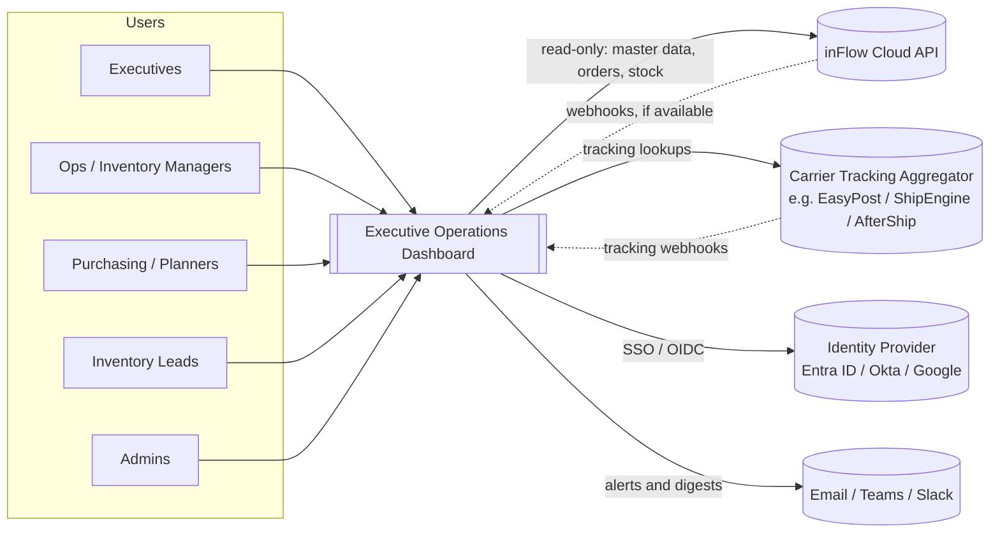

### 3.2 Container View

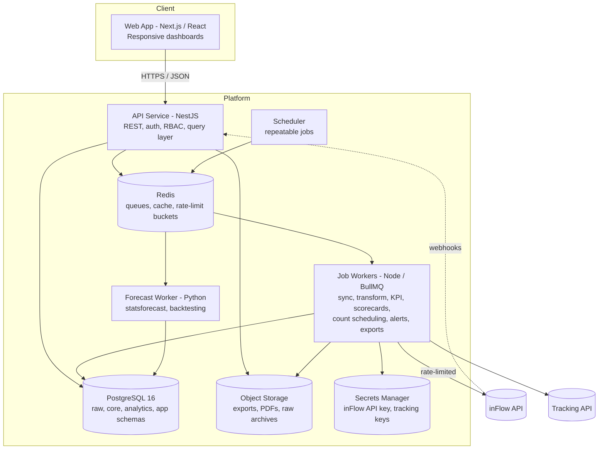

### 3.3 Data Flow (Pipeline Layers)

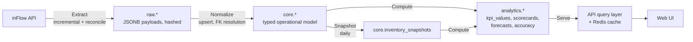

Every layer is idempotent and replayable. Raw payloads are retained, so a bug in normalization or KPI logic is fixed by re-running transforms, not by re-pulling from inFlow.

---

## 4. Technology Stack

| Layer | Choice | Rationale |
|---|---|---|
| Language (app) | **TypeScript** end to end | One language across UI and API; shared types and validation schemas. |
| Monorepo | **pnpm workspaces + Turborepo** | Shared packages (types, KPI definitions, UI kit) with cached builds. |
| Frontend | **Next.js (App Router), React, TanStack Query** | Mature SSR/CSR hybrid, routing, and good data-fetching ergonomics. |
| UI kit | **Tailwind CSS + shadcn/ui (Radix)** | Accessible primitives; fast to theme to brand. |
| Charts | **Apache ECharts** (via a thin wrapper) | Handles large series, confidence bands, heatmaps, and calendars well. |
| Grids | **TanStack Table** (AG Grid Community if heavy grid editing is needed) | Virtualized tables for drill-down evidence. |
| API | **NestJS** (modular monolith) | Clear module boundaries, DI, guards for RBAC, OpenAPI generation. |
| Validation | **Zod** (shared between web and API) | One schema source for request/response contracts. |
| ORM / migrations | **Drizzle ORM** + SQL migrations | SQL-first, good fit for analytical queries and materialized views. |
| Database | **PostgreSQL 16** (managed: AWS RDS or Azure Flexible Server) | Relational integrity for operational data; window functions and materialized views for analytics; JSONB for raw landing. |
| Queue / cache | **Redis + BullMQ** | Repeatable jobs, retries with backoff, concurrency control, rate-limit buckets. |
| Forecasting | **Python 3.12 + Nixtla statsforecast** (ETS, AutoARIMA, Croston/TSB, seasonal naive), pandas/polars | Fast, well-tested classical models suited to SKU-level demand; no GPU needed. |
| Auth | **OIDC SSO** (Entra ID / Okta / Google) via Auth.js on web + JWT verification in API | Reuses corporate identity and MFA policies. |
| PDF export | Headless Chromium rendering of print-styled pages | Scorecard PDFs match on-screen visuals. |
| Observability | **OpenTelemetry**, Sentry, structured JSON logs, CloudWatch / Grafana | Traces across API → queue → worker → inFlow calls. |
| Infra as code | **Terraform** | Reproducible environments (dev / staging / prod). |
| Hosting | **AWS**: ECS Fargate, RDS PostgreSQL, ElastiCache Redis, S3, Secrets Manager, CloudFront | Managed services and low ops overhead. (Azure equivalents are a like-for-like swap if the company is a Microsoft shop.) |
| CI/CD | **GitHub Actions** | Lint, typecheck, tests, migrations, container build, deploy. |

---

## 5. Key Architecture Decisions

Each decision is written as a lightweight ADR. Full ADRs live in `docs/adr/` once implementation starts.

**ADR-001 — Replicate inFlow data rather than querying the API live.**
*Context:* The inFlow API is rate-limited, paginated, and transactional; it has no aggregation endpoints and no historical stock positions. *Decision:* Sync into PostgreSQL and compute analytics locally. *Consequences:* Data is near-real-time rather than real-time (15-minute target), and we own sync correctness (handled by reconciliation jobs and a freshness indicator in the UI).

**ADR-002 — Modular monolith, not microservices.**
*Decision:* One NestJS API and one worker image sharing domain modules, plus one Python forecasting worker. *Rationale:* A small team, a single database, and shared transactional boundaries. Module boundaries (integration, kpi, forecasting, cycle-count, scorecard, alerting) are enforced by lint rules so we can split services later if needed.

**ADR-003 — PostgreSQL as both operational store and analytical store.**
*Decision:* Separate schemas (`raw`, `core`, `analytics`, `app`) in one cluster, with pre-aggregated `kpi_values` tables and materialized views. *Revisit trigger:* KPI queries exceed 1s at p95 after indexing and pre-aggregation, or order lines exceed roughly 10M. At that point, consider TimescaleDB, DuckDB, or a cloud warehouse.

**ADR-004 — Pre-compute KPIs; don't calculate them on request.**
*Decision:* KPI values are materialized per grain (day/week/month) and dimension (company, location, category, vendor, carrier) by workers after each sync. *Consequence:* Fast reads and auditable values (we store numerator and denominator). Definition changes trigger a backfill job.

**ADR-005 — Python for forecasting only.**
*Decision:* Forecasting runs in an isolated Python worker that reads from and writes to Postgres via the queue contract. *Rationale:* The best statistical forecasting libraries are in Python; isolating them keeps the main stack homogeneous.

**ADR-006 — The inFlow integration is read-only.**
*Decision:* The dashboard never writes to inFlow. Cycle counts are planned in the dashboard but performed and recorded in inFlow, and replenishment recommendations are exported for people to act on. *Consequences:* The dashboard can't corrupt inventory records, and the API key can be read-only if inFlow supports scoped keys. Any future write-back needs its own ADR.

**ADR-007 — Carrier delivery data from a tracking aggregator.**
*Decision:* Because inFlow stores carrier and tracking number but not delivery confirmation, a single aggregator API (EasyPost, ShipEngine, or AfterShip; chosen in Phase 0) supplies delivery events. Manual delivery-date entry is the fallback.

---

## 6. inFlow Integration Design

> **Note:** The endpoint names, filters, pagination style, rate limits, and webhook availability below reflect our current understanding of the inFlow Cloud API. **All of them must be confirmed in the Phase 0 API spike** against the live API documentation and a sandbox/test company.

### 6.1 Connection

- **Base:** `https://cloudapi.inflowinventory.com/{companyId}/...`
- **Auth:** API key sent as a bearer token. The key is stored in Secrets Manager and never in the database or the client.
- **Versioning:** inFlow uses a versioned `Accept` header. We pin the version in configuration and alert if the API returns deprecation signals.
- **Admin UX:** An admin enters the company ID and API key once. The system validates them with a lightweight read call and shows connection health.

### 6.2 Entity Coverage Matrix

| inFlow entity | Dashboard use | Sync mode | Expected frequency |
|---|---|---|---|
| Products (incl. categories, UoM, costs, item type) | All modules | Incremental | 15 min |
| Locations / sublocations | All modules | Full (small) | Hourly |
| Stock levels (by product × location × sublocation) | Inventory KPIs, count scheduling, forecasts | Full or incremental | 15 min + nightly snapshot |
| Vendors (+ vendor item pricing / lead times) | Vendor scorecards, replenishment | Incremental | Hourly |
| Customers | Sales KPIs | Incremental | Hourly |
| Purchase orders (+ lines, receiving) | Purchasing KPIs, vendor scorecards | Incremental | 15 min |
| Sales orders (+ lines, picking/packing/shipping, carrier, tracking #) | Sales and fulfillment KPIs, carrier scorecards, forecast actuals | Incremental | 15 min |
| Manufacturing orders (+ BOM, components, completion) | Manufacturing KPIs, dependent demand | Incremental | 15 min |
| Bills of materials | Dependent demand explosion | Incremental | Daily |
| Stock adjustments / transfers | Inventory movement history, velocity | Incremental | 15 min |
| Stock counts (optional) | Marking scheduled counts done when a matching count is completed in inFlow | Incremental | Hourly |

### 6.3 Sync Strategy

Three complementary modes:

1. **Initial backfill.** Full paginated pull of every entity, ordered by dependency (locations → categories → products → vendors/customers → BOMs → POs → SOs → MOs → adjustments → counts). This is resumable: the cursor is checkpointed per page, so a crash resumes instead of restarting.
2. **Incremental sync** (every 15 minutes in business hours, hourly otherwise). For each entity, request records modified since `watermark − overlap` (a 5-minute overlap absorbs clock skew), upsert them into `raw`, then normalize the changed keys into `core`.
3. **Nightly reconciliation.** Pull ID + last-modified lists (or full lists for small entities), detect deletes and missed updates, compare stock-level totals, and write a reconciliation report to `app.sync_runs`. A mismatch above threshold raises an admin alert.

**Webhooks (if inFlow supports them for the entity):** Treated as *hints* that enqueue a targeted fetch of the changed record. They never replace polling, and the payload is never trusted as the full record.

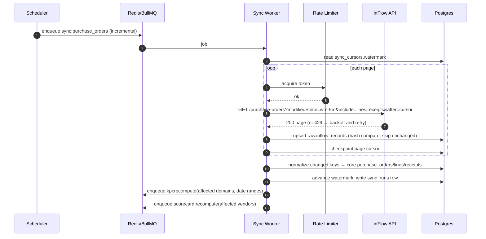

### 6.4 Rate Limiting and Resilience

- **Token bucket in Redis**, shared across all workers, configured below inFlow's published limit (default: 80% of the documented cap). One global bucket per inFlow company.
- **Priority lanes:** Targeted fetches (webhook hints, admin-triggered syncs) go ahead of bulk backfill pages.
- **Retries:** Exponential backoff with jitter on 429/5xx, honoring `Retry-After`. After 5 attempts the job goes to a dead-letter queue and shows in Admin → Sync.
- **Circuit breaker:** After N consecutive failures, pause the entity's sync and alert admins rather than hammering the API.
- **Idempotency:** Upserts keyed on `(entity, inflow_id)`. A content hash avoids rewriting unchanged rows.
- **Schema drift:** Normalizers validate payloads with Zod. Unknown fields are kept in raw, and missing required fields quarantine the record (it isn't dropped silently) and surface a warning.

### 6.5 Data Freshness Contract

Every API response that serves KPI or entity data includes `dataAsOf` (the oldest last-successful-sync watermark among the entities it depends on). The UI shows a **Data Freshness badge** that turns amber after 45 minutes and red after 2 hours.

---

## 7. Data Architecture and Database Schema

### 7.1 Schema Layout

| Schema | Purpose | Written by | Read by |
|---|---|---|---|
| `raw` | Immutable-ish landing of inFlow and tracking payloads (JSONB) | Sync workers | Normalizers, debugging |
| `core` | Typed, normalized operational model mirroring inFlow plus enrichments | Normalizers | Everything |
| `analytics` | Derived facts: KPI values, forecasts, scorecards, accuracy | Compute workers, forecast worker | API |
| `ops` | Dashboard-owned planning data: count schedules, quality events, overrides | API (user actions) | API, workers |
| `app` | Users, roles, configuration, sync bookkeeping, alerts, audit | API, workers | API |

**Conventions**

- Surrogate keys are `uuid` (v7, time-ordered). inFlow IDs are stored as `inflow_id` with a unique index.
- All tables carry `created_at` and `updated_at` (timestamptz). `core` tables also carry `source_modified_at` and `is_deleted` (soft delete from reconciliation).
- Money is `numeric(18,4)` plus a `currency` code. Quantities are `numeric(18,4)` because UoM can be fractional.
- Dates used for KPI bucketing are stored in the company's **local business timezone** as `date` columns alongside raw timestamps.

### 7.2 Entity-Relationship Overview (core)

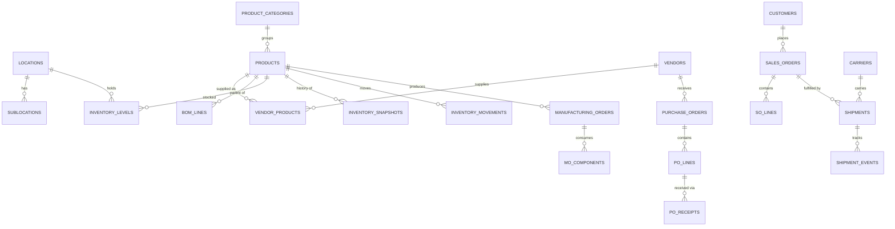

### 7.3 `app` Schema — Identity, Configuration, Sync

**`app.users`**

| Column | Type | Notes |
|---|---|---|
| id | uuid PK | |
| idp_subject | text UNIQUE | OIDC `sub` |
| email | citext UNIQUE | |
| display_name | text | |
| role | enum `admin, executive, ops_manager, planner, inventory_lead, viewer` | Primary role |
| is_active | boolean | |
| last_login_at | timestamptz | |

**`app.user_location_access`** — (user_id FK, location_id FK) composite PK. Empty means all locations.

**`app.integration_connections`**

| Column | Type | Notes |
|---|---|---|
| id | uuid PK | |
| provider | enum `inflow, tracking_aggregator` | |
| external_account_id | text | inFlow company ID |
| secret_ref | text | ARN/path in Secrets Manager, never the key itself |
| api_version | text | Pinned inFlow API version |
| status | enum `active, degraded, paused, error` | |
| last_success_at | timestamptz | |

**`app.sync_cursors`** — (connection_id, entity) PK, watermark timestamptz, last_cursor text, last_run_id FK.

**`app.sync_runs`**

| Column | Type | Notes |
|---|---|---|
| id | uuid PK | |
| connection_id | uuid FK | |
| entity | text | e.g. `purchase_orders` |
| mode | enum `backfill, incremental, reconcile, targeted` | |
| status | enum `running, succeeded, partial, failed` | |
| started_at / finished_at | timestamptz | |
| pages_fetched, records_fetched, records_changed, records_quarantined | int | |
| api_calls, throttled_calls | int | |
| error_summary | text | |

**`app.webhook_inbox`** — id, provider, event_type, external_id, payload jsonb, signature_valid boolean, received_at, processed_at, status. Unique on (provider, provider_event_id) for dedupe.

**`app.audit_log`** — id bigserial, occurred_at, user_id, action, entity_type, entity_id, before jsonb, after jsonb, ip, user_agent. Append-only; the application role has no UPDATE/DELETE grant.

**`app.saved_views`** — id, user_id, page_key, name, filters jsonb, layout jsonb, is_default, is_shared.

**`app.feature_flags`** — key PK, enabled, rollout jsonb.

### 7.4 `raw` Schema — Landing

**`raw.inflow_records`**

| Column | Type | Notes |
|---|---|---|
| entity | text | PK part |
| inflow_id | text | PK part |
| payload | jsonb | Full record including requested includes |
| payload_hash | bytea | SHA-256 for change detection |
| source_modified_at | timestamptz | |
| first_seen_at / last_fetched_at | timestamptz | |
| sync_run_id | uuid FK | |
| normalize_status | enum `pending, ok, quarantined` | |
| normalize_error | text | |

Index on (entity, normalize_status) for the transform queue. Older payload versions are optionally archived to S3 as Parquet (by date) for full history.

**`raw.tracking_events`** — provider, tracking_number, carrier_code, payload jsonb, received_at.

### 7.5 `core` Schema — Operational Model

**Master data**

| Table | Key columns |
|---|---|
| `core.locations` | id, inflow_id, name, type (`warehouse, store, production, virtual`), timezone, is_active |
| `core.sublocations` | id, location_id FK, code (bin), zone, is_countable |
| `core.product_categories` | id, inflow_id, name, parent_id (self FK), path (ltree) |
| `core.products` | id, inflow_id, sku UNIQUE, name, category_id FK, item_type (`stocked, non_stocked, service, assembled/manufactured`), base_uom, standard_cost, avg_cost, list_price, is_active, **abc_class** (by value; sets forecasting service levels), **velocity_class** (sets count frequency), **xyz_class**, classification_updated_at, lead_time_days_override, safety_stock_override, source_modified_at |
| `core.vendors` | id, inflow_id, name, code, payment_terms, default_lead_time_days, currency, is_active |
| `core.vendor_products` | vendor_id FK, product_id FK (composite PK), vendor_sku, unit_cost, quoted_lead_time_days, min_order_qty, is_preferred |
| `core.customers` | id, inflow_id, name, type, region, is_active |
| `core.carriers` | id, code UNIQUE, name, scac, tracking_provider_code, is_active |
| `core.carrier_aliases` | alias text PK, carrier_id FK, service_level — maps the free-text carrier/shipping-method values found in inFlow to a canonical carrier |
| `core.bom_lines` | id, parent_product_id FK, component_product_id FK, qty_per, scrap_pct, effective_from/to |

**Inventory**

| Table | Key columns | Notes |
|---|---|---|
| `core.inventory_levels` | product_id, location_id, sublocation_id (PK triple), qty_on_hand, qty_reserved, qty_on_order, qty_available, unit_cost, synced_at | Current state, overwritten each sync |
| `core.inventory_snapshots` | snapshot_date, product_id, location_id (PK), qty_on_hand, qty_reserved, qty_on_order, unit_cost, extended_value | Built nightly by us, since inFlow has no stock history. **Partitioned by month.** |
| `core.inventory_movements` | id, product_id, location_id, sublocation_id, movement_type (`receipt, shipment, adjustment, transfer_in, transfer_out, mo_consume, mo_produce, count_adjust`), qty (signed), unit_cost, occurred_at, business_date, source_doc_type, source_doc_id, reason_code | Unified ledger derived from POs, SOs, MOs, adjustments, and transfers. Partitioned by month. |

**Purchasing**

| Table | Key columns |
|---|---|
| `core.purchase_orders` | id, inflow_id, po_number, vendor_id FK, location_id FK, status (`open, issued, partially_received, received, cancelled, closed`), order_date, **promised_date** (vendor-confirmed), requested_date, currency, subtotal, freight, total, created_by, source_modified_at |
| `core.po_lines` | id, po_id FK, line_no, product_id FK, qty_ordered, unit_cost, line_promised_date, qty_received_total (denormalized) |
| `core.po_receipts` | id, po_id FK, po_line_id FK, product_id FK, location_id, sublocation_id, qty_received, received_at, business_date, inflow_receipt_ref |

**Sales and fulfillment**

| Table | Key columns |
|---|---|
| `core.sales_orders` | id, inflow_id, so_number, customer_id FK, location_id FK, status, order_date, requested_ship_date, promised_ship_date, promised_delivery_date, channel, currency, subtotal, discount, freight_charged, total, source_modified_at |
| `core.so_lines` | id, so_id FK, line_no, product_id FK, qty_ordered, qty_shipped_total, unit_price, discount, unit_cost_at_sale |
| `core.shipments` | id, so_id FK, carrier_id FK (nullable until mapped), carrier_raw text, service_level, tracking_number, shipped_at, ship_business_date, promised_delivery_at, **delivered_at**, delivery_source (`tracking_api, manual, inferred`), freight_cost, weight, packages, status (`label_created, in_transit, delivered, exception, returned`), last_tracking_sync_at |
| `core.shipment_lines` | shipment_id FK, so_line_id FK, qty_shipped |
| `core.shipment_events` | id, shipment_id FK, status, description, occurred_at, location_text, is_exception, exception_code |

**Manufacturing**

| Table | Key columns |
|---|---|
| `core.manufacturing_orders` | id, inflow_id, mo_number, product_id FK, location_id FK, status (`planned, released, in_progress, completed, cancelled`), qty_planned, qty_completed, start_date, due_date, completed_at, labor_cost, overhead_cost |
| `core.mo_components` | id, mo_id FK, component_product_id FK, qty_required, qty_consumed, unit_cost |

**Key indexes:** `(vendor_id, order_date)` on POs; `(customer_id, order_date)` and `(location_id, order_date)` on SOs; `(product_id, business_date)` on movements; `(carrier_id, ship_business_date)` on shipments; `(due_date, status)` on MOs; and GIN on `raw.payload` only for debugging paths.

### 7.6 `analytics` Schema — Derived Facts

**`analytics.dim_date`** — date PK, iso_week, fiscal_week, fiscal_month, fiscal_quarter, fiscal_year, is_business_day, holiday_name. This drives the fiscal calendar (4-4-5 or calendar months, configured).

**`analytics.kpi_definitions`**

| Column | Type | Notes |
|---|---|---|
| code | text PK | e.g. `inventory_turns` |
| name, description | text | Plain-English definition shown in UI |
| domain | enum `inventory, sales, fulfillment, purchasing, manufacturing, forecasting, counts` | |
| unit | enum `currency, percent, ratio, days, count, quantity` | |
| direction | enum `higher_is_better, lower_is_better, target_band` | Drives coloring |
| grains | text[] | `{day, week, month, quarter}` |
| dimensions | text[] | `{company, location, category, vendor, carrier, customer}` |
| calc_version | int | Bumped when logic changes, which triggers a backfill |
| owner_user_id | uuid FK | Accountable executive |
| is_active | boolean | |

**`analytics.kpi_targets`** — id, kpi_code FK, dimension_type, dimension_id (nullable = company), effective_from, effective_to, target_value, warning_threshold, critical_threshold, set_by, set_at.

**`analytics.kpi_values`** — Main read model for dashboards

| Column | Type | Notes |
|---|---|---|
| kpi_code | text | PK part |
| grain | enum | PK part |
| period_start | date | PK part |
| dimension_type | text | PK part (`company`, `location`, ...) |
| dimension_id | uuid | PK part (all-zero UUID for company) |
| value | numeric | |
| numerator / denominator | numeric | Auditable composition, enables correct roll-ups |
| sample_size | int | |
| is_final | boolean | False for the current open period |
| calc_version | int | |
| computed_at | timestamptz | |

Partitioned by `grain`, with BRIN on `period_start`.

**`analytics.kpi_annotations`** — id, kpi_code, period_start, dimension_type/id, note, author_id, created_at (for example "Port strike delayed inbound").

**Forecasting**

| Table | Key columns |
|---|---|
| `analytics.forecast_runs` | id, trigger (`scheduled, manual, backfill`), grain (`week`), horizon_periods, history_start, data_cutoff_date, model_candidates text[], status, started_at, finished_at, series_count, params jsonb, initiated_by |
| `analytics.forecast_series` | run_id FK, product_id, location_id (PK triple), demand_class (`smooth, erratic, intermittent, lumpy, new, inactive`), selected_model, backtest_wape, backtest_bias, backtest_mase, history_periods, is_low_confidence |
| `analytics.forecasts` | run_id, product_id, location_id, period_start (PK), qty_p10, qty_p50, qty_p90, model_name. Partitioned by run month |
| `analytics.forecast_published` | product_id, location_id, period_start (PK), run_id, qty_final (after overrides), qty_statistical, override_id — the **current consensus forecast** read by the UI |
| `analytics.forecast_accuracy` | product_id, location_id, period_start, lag_periods (PK), forecast_run_id, forecast_qty, actual_qty, abs_error, error — enables WAPE/bias by lag |
| `analytics.replenishment_recommendations` | run_id, product_id, location_id (PK), on_hand, on_order, avg_daily_demand, demand_std, lead_time_days, lead_time_std, service_level_target, safety_stock, reorder_point, eoq, suggested_order_qty, suggested_order_date, preferred_vendor_id, projected_stockout_date, days_of_cover, status (`new, reviewed, exported, dismissed`) |

**Scorecards**

| Table | Key columns |
|---|---|
| `analytics.scorecard_templates` | id, subject_type (`vendor, carrier`), name, version, is_default, period_type (`month, quarter`), min_sample_size, grade_scale jsonb (for example A ≥ 90, B ≥ 80…) |
| `analytics.scorecard_template_metrics` | template_id, metric_code (PK pair), weight (sum = 100), target_value, floor_value, scoring_method (`linear, step, inverse_linear`), is_required |
| `analytics.scorecard_results` | id, template_id, subject_type, subject_id, period_start, period_end, overall_score, grade, rank, rank_of, trend_delta, sample_size, is_provisional, computed_at. Unique (template_id, subject_id, period_start) |
| `analytics.scorecard_metric_results` | result_id FK, metric_code (PK pair), raw_value, numerator, denominator, normalized_score (0–100), weighted_score, sample_size |

### 7.7 `ops` Schema — Workflows Owned by the Dashboard

**Cycle count scheduling** (planning only; counts are recorded in inFlow)

| Table | Key columns |
|---|---|
| `ops.velocity_settings` | location_id (nullable = default) PK, lookback_days (default 90), metric (`transactions, units`), fast_cutoff_pct (default 80), medium_cutoff_pct (default 95), demote_after_runs (default 2) |
| `ops.count_policies` | id, location_id (nullable = default), velocity_class (`fast, medium, slow, dormant`), interval_weeks (default 1 / 2 / 4 / 52), placement_window_days (default 2 / 3 / 5 / 10), is_active |
| `ops.velocity_classifications` | product_id, location_id, classified_on (PK triple), transactions, units_moved, rank, cumulative_pct, velocity_class, previous_class, is_override |
| `ops.velocity_overrides` | product_id, location_id (PK pair), forced_class, reason, set_by, set_at, expires_at |
| `ops.count_calendars` | id, location_id, working_days int[] (ISO DOW), daily_capacity_lines, blackout_dates date[] |
| `ops.count_schedules` | id, location_id, name, period_start, period_end, status (`draft, published, superseded`), generation_params jsonb, generated_at, published_by, published_at |
| `ops.count_schedule_lines` | id, schedule_id FK, product_id, location_id, sublocation_id, scheduled_date, due_date, velocity_class, reason (`velocity_cycle, new_item, manual`), walk_sequence, is_locked, completed_in_inflow_at (nullable; set by the optional stock count sync), inflow_stock_count_id |

**Supplier quality (not available in inFlow)**

| Table | Key columns |
|---|---|
| `ops.vendor_quality_events` | id, vendor_id, po_id (nullable), product_id, event_type (`defect, damaged, wrong_item, short_ship_undisclosed, late_asn, documentation_error`), qty_affected, cost_impact, severity, occurred_at, reported_by, disposition, notes |
| `ops.carrier_claims` | id, carrier_id, shipment_id, claim_type (`damage, loss, delay`), amount_claimed, amount_recovered, filed_at, resolved_at, status |

**Planner inputs**

| Table | Key columns |
|---|---|
| `ops.forecast_overrides` | id, product_id, location_id, period_start, period_end, override_type (`absolute, percent`), value, reason_code (`promotion, new_customer, lost_customer, supply_constraint, other`), comment, created_by, created_at, expires_at, is_active |
| `ops.scorecard_reviews` | id, scorecard_result_id, reviewer_id, status (`draft, reviewed, shared_with_vendor`), summary, action_items jsonb, reviewed_at |

### 7.8 Alerting

| Table | Key columns |
|---|---|
| `app.alert_rules` | id, name, rule_type (`kpi_threshold, kpi_trend, stockout_risk, late_po, sync_failure, missed_counts`), kpi_code, dimension filter jsonb, comparator, threshold, evaluation_grain, cooldown_minutes, channels text[] (`in_app, email, teams, slack`), recipients jsonb, is_active, owner_id |
| `app.alert_events` | id, rule_id, triggered_at, context jsonb (value, dimension, link), severity, status (`open, acknowledged, resolved, suppressed`), acknowledged_by, acknowledged_at |
| `app.digest_subscriptions` | user_id, digest_type (`daily_exec, weekly_ops, monthly_scorecards`), channel, send_time_local, is_active |

### 7.9 Data Retention

| Data | Retention |
|---|---|
| raw payloads (latest) | Indefinite. Prior versions go to S3 Parquet for 7 years. |
| core | Indefinite (soft-deleted rows retained) |
| inventory_snapshots, movements | 7 years, monthly partitions |
| forecasts (non-published runs) | 18 months, then dropped by partition |
| audit_log | 7 years |
| sync_runs | 13 months |

---

## 8. Functional Module Design

### 8.1 KPI Engine

**Starter KPI catalog** (finalized with executives in Phase 0):

| Domain | KPI | Definition (summary) | Direction |
|---|---|---|---|
| Inventory | Inventory Value | Σ on-hand qty × unit cost at period end | Target band |
| Inventory | Inventory Turns | Annualized COGS ÷ average inventory value | Higher |
| Inventory | Days of Inventory on Hand | Avg inventory value ÷ (COGS ÷ days in period) | Lower (target band) |
| Inventory | Excess & Obsolete % | Value of SKUs with no movement in 180 days or cover > 365 days ÷ total value | Lower |
| Inventory | Stockout Rate | % of active stocked SKU-locations with available ≤ 0 (daily avg) | Lower |
| Inventory | Count Schedule Completion | Scheduled counts completed in inFlow by their scheduled date ÷ counts due (needs the optional stock count sync) | Higher |
| Sales | Revenue / Gross Margin % | Shipped revenue; (revenue − COGS) ÷ revenue | Higher |
| Sales | Backlog Value | Open SO value not yet shipped | Target band |
| Fulfillment | Order Fill Rate | Units shipped complete on first shipment ÷ units ordered | Higher |
| Fulfillment | OTIF (customer) | Orders shipped in full by promised ship date ÷ orders due | Higher |
| Fulfillment | Order Cycle Time | Median hours from order to ship | Lower |
| Purchasing | Vendor OTIF | PO lines received in full by promised date ÷ lines due | Higher |
| Purchasing | Purchase Price Variance | Σ (actual − standard/last cost) × qty | Lower |
| Purchasing | Open PO Value / Past-Due POs | Value and count of POs past promised date | Lower |
| Manufacturing | MO Schedule Adherence | MOs completed by due date ÷ MOs due | Higher |
| Manufacturing | Production Yield | Qty completed ÷ qty planned (completed MOs) | Higher |
| Manufacturing | Throughput | Units produced per period | Higher |
| Manufacturing | WIP Value | Component value consumed in open MOs | Target band |
| Forecasting | Forecast Accuracy (1 − WAPE) / Bias | At lag 1 and lag 4 weeks | Higher / ≈0 |

**Computation model**

- Each KPI is a server-side **KPI calculator** registered by code. It declares its source tables, supported grains and dimensions, and a SQL query template that produces `(period_start, dimension_id, numerator, denominator, sample_size)`.
- **Triggers:** (a) after each sync, recompute open periods for affected domains; (b) nightly, finalize yesterday and recompute the trailing 35 days to catch late edits; (c) on `calc_version` bump or target change, backfill the full history.
- **Roll-ups** use numerator and denominator (never average-of-averages).
- **Comparisons:** prior period, same period last year, and target, all computed at read time from `kpi_values`.

### 8.2 Forecasting

**Scope:** Weekly demand per SKU × location, horizon of 26 weeks, refreshed weekly (Sunday night) and on demand.

**Pipeline**

1. **Build demand history.** Shipped quantity by requested-ship week (so we capture *demand*, not constrained supply) from `so_lines`/`shipments`, plus **dependent demand** from MO component requirements for manufactured items' components. Stockout weeks are flagged and imputed so lost sales don't bias the forecast downward.
2. **Classify each series** (Syntetos–Boylan ADI/CV²): smooth, erratic, intermittent, lumpy; also new (< 13 weeks of history) and inactive.
3. **Candidate models by class:**
   - Smooth/erratic: AutoETS, AutoARIMA, seasonal naive, and Theta.
   - Intermittent/lumpy: Croston (SBA), TSB, and ADIDA.
   - New: category-level profile scaled by available history, flagged low-confidence.
4. **Backtest** using a rolling origin (3 folds × 8 weeks). Select per series by lowest WAPE with a bias guardrail.
5. **Fit and predict** p10/p50/p90 (conformal intervals where the model has no native intervals).
6. **Apply overrides** from `ops.forecast_overrides` and write `forecast_published`.
7. **Replenishment calculation:**
   - ABC class (by trailing-12-month usage value: A ≈ top 80%, B next 15%, C the rest) is recalculated monthly and sets the service-level target.
   - Safety stock = z(service level by ABC class) × √(LT × σ_d² + d̄² × σ_LT²)
   - Reorder point = d̄ × LT + safety stock
   - Suggested order quantity = max(EOQ, MOQ) rounded to pack size when inventory position ≤ ROP
   - Projected stockout date from an on-hand + on-order − forecast projection.
   - Lead-time mean and σ come from **actual PO receipt history** (shared with the vendor scorecard), falling back to the quoted lead time.
8. **Accuracy tracking.** When actuals land, write `forecast_accuracy` at lags 1, 4, and 8. This feeds the Forecast Accuracy KPI.

**Execution:** The API enqueues `forecast:run`. The Python worker reads its inputs via SQL, processes series in parallel chunks of about 2,000, writes results in bulk (COPY), and reports progress to the job record so the UI can show a progress bar.

### 8.3 Cycle Count Scheduling

The dashboard **plans** cycle counts; it doesn't run them. Counting, entering results, and adjusting inventory all stay in inFlow. The output is a calendar of which SKUs to count, where, and on which day, plus printable daily count sheets.

**Velocity classification** (weekly, Sunday night after the sync, or on demand)

1. For each SKU × location, measure velocity over a trailing window (default 90 days):
   - **Transactions** (default): the number of outbound movement lines, meaning shipment lines, MO component consumption, and transfers out. Count errors build up with each transaction, so this is the better driver of count frequency.
   - **Units moved:** available as an alternative setting.
2. Rank SKUs within each location from fastest to slowest and assign classes by cumulative share of total transactions (cutoffs are configurable):

   | Class | Default rule | Count cadence | Placement window |
   |---|---|---|---|
   | Fast | SKUs making up the top 80% of transactions | **Weekly** (every week) | ±2 working days, never leaves its week |
   | Medium | The next 15% | **Biweekly** (every 2 weeks) | ±3 working days |
   | Slow | Remaining SKUs with any movement | **Monthly** (every 4 weeks) | ±5 working days |
   | Dormant | No movement in the window, but stock on hand | Yearly | ±10 working days |

   Cadences are stored in weeks so they line up with the weekly schedule refresh. "Monthly" therefore means every 4 weeks (13 counts a year).

   SKUs with no movement and nothing on hand are left off the schedule.
3. **Overrides:** A planner can pin a SKU to a class (for example, a slow-moving item that is prone to theft), optionally with an expiry date.
4. **Stability:** A SKU moves *up* a class immediately, but only moves *down* after two weekly runs in a row agree. This stops the schedule from churning on a single quiet week.

**Schedule generation**

1. **Inputs:** location, period (default: the next 13 weeks), cadence for each class, the location's working days, daily capacity (SKU-locations per day), and blackout dates (month-end, physical inventory, etc.).
2. **Feasibility check:** Before placing anything, compute the required load: for each class, the number of SKU-locations ÷ the working days in its cadence, summed across classes. Weekly counting of fast movers is heavy (for example, 1,000 fast SKUs across 5 working days is 200 counts a day before any other class). If the required load exceeds daily capacity, the preview says by how much and offers the fixes: raise capacity, tighten the Fast cutoff, or lengthen a cadence. A schedule that can't meet its cadences can only be published with an explicit acknowledgment, and the shortfall is shown on the calendar.
3. **Due dates:** Each SKU-location's next due date is its last count date plus its cadence. The last count date comes from inFlow stock counts if that sync is available, otherwise from the previous schedule. New SKUs are due immediately.
4. **Placement:** Each count goes on the working day nearest its due date. A greedy fill then levels the load so no day exceeds capacity; when a day is full, the count moves to the nearest day with room inside its class's placement window. Fast movers are placed first so they keep their weekly slot. Counts in the same zone or aisle are grouped onto the same day when that stays inside every count's window. A count that can't fit inside its window is flagged as at risk, not silently pushed later.
5. **Walk order:** Each day's list is sorted by sublocation (bin) path so it can be counted in one pass.
6. **Review and publish:** The inventory lead previews the calendar and load chart, drags lines between days or locks them, then publishes.
7. **Rolling refresh:** Each week, after reclassification, the next 13 weeks are regenerated. The current week and any locked lines stay fixed; everything else is re-planned for class changes, new SKUs, and (if available) counts already completed in inFlow.

**Outputs**

- A month/week calendar showing scheduled counts per day against capacity.
- A daily count sheet per location: SKU, description, bin, UoM, and a blank column for the counted quantity. System quantity is left off by default so counts stay blind. It exports as PDF, CSV, or XLSX and can be emailed to the inventory lead each morning.
- If the stock count sync is enabled, an **adherence view** shows which scheduled counts were completed in inFlow on time, late, or not at all. This feeds the Count Schedule Completion KPI.

### 8.4 Vendor Scorecards

**Default template** (weights editable per template version):

| Metric | Calculation | Default weight | Source |
|---|---|---|---|
| On-Time Delivery | PO lines whose first receipt is ≤ promised date (+ grace days) ÷ lines due in period | 30 | PO lines and receipts |
| In-Full Rate | Lines received ≥ 98% of ordered qty (configurable) ÷ lines closed | 20 | PO lines and receipts |
| Lead-Time Reliability | 100 − normalized σ of (actual − quoted lead time) | 15 | POs, vendor_products |
| Price Variance | Σ (invoice/PO cost − standard or contract cost) × qty ÷ spend | 15 | PO lines, product costs |
| Quality | 1 − (qty affected by quality events ÷ qty received) | 20 | ops.vendor_quality_events |

Additional display-only metrics: spend, PO count, average lead time, and late-PO aging.

**Scoring:** Each metric is normalized to 0–100 between `floor_value` and `target_value` (linear by default). The overall score is the weighted sum, mapped to a letter grade. Vendors below `min_sample_size` POs in the period are shown as "Insufficient data" rather than scored. Results are recomputed after relevant syncs while a period is open, and locked (`is_provisional = false`) N days after period close.

### 8.5 Carrier Scorecards

**Data assembly:**

1. Shipments come from inFlow SO fulfillment (carrier/shipping method text, tracking number, ship date, freight cost).
2. **Carrier mapping:** Free-text carrier values are mapped via `core.carrier_aliases`. Unmapped values land in an Admin queue.
3. **Tracking enrichment:** A worker registers new tracking numbers with the aggregator and ingests webhook events into `shipment_events`. It sets `delivered_at`, exceptions, and promised delivery (carrier ETA or service-level standard).

**Default template:**

| Metric | Calculation | Default weight |
|---|---|---|
| On-Time Delivery | Delivered ≤ promised delivery date ÷ delivered shipments | 35 |
| Transit-Time Reliability | % within ±1 day of the service-level standard; σ of transit days | 15 |
| Damage / Claims Rate | Claims (damage + loss) ÷ shipments | 20 |
| Cost Efficiency | Freight cost per shipment (or per lb) vs. target, and vs. other carriers for the same lane/service | 20 |
| Tracking Compliance | Shipments with valid tracking and first scan within 24h of ship ÷ shipments | 10 |

Breakdowns by service level, origin location, and destination region.

---

## 9. Backend Module and API Design

### 9.1 Module Structure (NestJS modular monolith)

```
apps/
  web/                    Next.js frontend (dashboards)
  api/                    NestJS HTTP API
  worker/                 BullMQ job processors (same domain packages as api)
  forecaster/             Python forecasting worker
packages/
  domain-integration/     inFlow client, rate limiter, sync orchestration, normalizers
  domain-kpi/             KPI registry, calculators, targets
  domain-forecasting/     job contracts, override logic, replenishment reads
  domain-cycle-count/     velocity classifier, schedule generator, count sheet exports
  domain-scorecard/       metric calculators, template scoring engine
  domain-alerting/        rule evaluation, notification adapters
  db/                     Drizzle schema, migrations, query helpers
  contracts/              Zod schemas shared by web and api (request/response DTOs)
  ui/                     Shared React components, chart wrappers, design tokens
  config/                 eslint, tsconfig, boundary rules
infra/                    Terraform
docs/                     This document, ADRs, KPI dictionary, runbooks
```

*(This is a directory layout to guide implementation, not code.)*

### 9.2 REST API Surface (v1)

All routes are prefixed `/api/v1`. Responses include `dataAsOf`. Lists support cursor pagination, sorting, and the shared filter set (`from`, `to`, `grain`, `locationIds`, `categoryIds`, `compare`).

| Area | Endpoint | Purpose |
|---|---|---|
| Session | `GET /me` | Profile, role, permissions, location scope |
| KPIs | `GET /kpis/definitions` | Catalog with definitions and owners |
| | `GET /kpis/overview` | Executive tile set: value, comparison, target status, sparkline |
| | `GET /kpis/{code}/series` | Time series by grain and dimension |
| | `GET /kpis/{code}/breakdown` | Values by dimension for a period |
| | `GET /kpis/{code}/contributors` | Underlying documents (drill to source) |
| | `PUT /kpis/{code}/targets` | Set targets *(executive/admin)* |
| | `POST /kpis/{code}/annotations` | Add an annotation |
| Forecasting | `GET /forecasts/summary` | Accuracy, risk counts, last run |
| | `GET /forecasts/items/{productId}` | History + forecast bands + overrides + projection |
| | `POST /forecasts/overrides` / `DELETE /forecasts/overrides/{id}` | Planner overrides |
| | `GET /replenishment/recommendations` | Filterable recommendation list |
| | `PATCH /replenishment/recommendations/{id}` | Mark reviewed/dismissed |
| | `POST /replenishment/export` | CSV/XLSX for inFlow PO import |
| | `POST /forecasts/runs` / `GET /forecasts/runs/{id}` | Trigger a run and track progress |
| Cycle counts | `GET/PUT /cycle-counts/policies` | Cadence and placement window for each velocity class, velocity cutoffs, capacity, blackout dates |
| | `GET /cycle-counts/velocity` | Velocity class per SKU-location, with the movement figures behind it |
| | `PUT /cycle-counts/velocity/overrides` | Pin a SKU to a class |
| | `POST /cycle-counts/schedules/preview` | Generate a draft (no persistence) |
| | `POST /cycle-counts/schedules` / `POST .../{id}/publish` | Save and publish |
| | `GET /cycle-counts/schedule` | Scheduled counts by date range (filter by location, class, zone) |
| | `PATCH /cycle-counts/schedule-lines/{id}` | Move a line to another day, or lock it |
| | `POST /cycle-counts/sheets/export` | Count sheet for a day as PDF / CSV / XLSX (async) |
| | `GET /cycle-counts/adherence` | Scheduled vs completed in inFlow (needs the stock count sync) |
| Scorecards | `GET /scorecards/{vendor|carrier}` | Leaderboard for a period |
| | `GET /scorecards/{vendor|carrier}/{id}` | Detail, metric breakdown, and trend |
| | `GET /scorecards/{vendor|carrier}/{id}/evidence` | Underlying POs/shipments for a metric |
| | `POST /scorecards/{vendor|carrier}/{id}/export` | PDF generation (async) |
| | `POST /quality-events`, `POST /carrier-claims` | Manual data capture |
| | `GET/PUT /scorecards/templates/{id}` | Template weights and targets *(admin)* |
| Alerts | `GET/POST/PUT /alerts/rules`, `GET /alerts/events`, `POST /alerts/events/{id}/ack` | |
| Admin | `GET /admin/integration`, `PUT /admin/integration` | inFlow connection settings |
| | `GET /admin/sync/runs`, `POST /admin/sync/{entity}` | Sync monitoring and manual trigger |
| | `GET /admin/carrier-aliases/unmapped`, `PUT /admin/carrier-aliases` | Carrier mapping |
| | `GET/POST/PATCH /admin/users` | User and role management |
| | `GET /admin/audit` | Audit log search |
| Webhooks | `POST /webhooks/inflow`, `POST /webhooks/tracking` | Signature-verified, enqueue-only |

### 9.3 Background Jobs

| Queue | Job | Schedule / Trigger |
|---|---|---|
| `sync` | `sync:{entity}:incremental` | Every 15 min (business hours), hourly off-hours |
| `sync` | `sync:{entity}:reconcile` | Nightly 01:00 |
| `sync` | `sync:targeted` | Webhook hint |
| `transform` | `normalize:{entity}` | After a sync page batch |
| `snapshot` | `snapshot:inventory` | Nightly 23:55 local |
| `compute` | `kpi:recompute` | After sync; nightly finalize 02:00 |
| `compute` | `scorecard:recompute` | After PO/shipment changes; nightly |
| `compute` | `abc:classify` | Monthly, 1st business day |
| `counts` | `velocity:classify` | Weekly, Sun 21:00 |
| `counts` | `counts:refresh-schedule` | Weekly, after `velocity:classify` |
| `forecast` | `forecast:run` | Weekly Sun 22:00; manual |
| `tracking` | `tracking:register`, `tracking:poll` | On new shipment; hourly fallback poll |
| `counts` | `counts:daily-sheet` | Daily 05:00 (email count sheets) |
| `alerts` | `alerts:evaluate` | After KPI recompute; every 15 min |
| `notify` | `digest:send` | Per subscription schedule |
| `export` | `export:pdf`, `export:xlsx` | On demand |

---

## 10. Frontend Component Hierarchy

### 10.1 Application Shell and Providers

```
<RootLayout>
├── <AuthProvider>                     OIDC session, token refresh
├── <QueryClientProvider>              TanStack Query cache
├── <ThemeProvider>                    light/dark, brand tokens
├── <PermissionProvider>               role → capability map; <Can> helper
├── <GlobalFilterProvider>             date range, grain, locations, compare mode (URL-synced)
└── <AppShell>
    ├── <TopBar>
    │   ├── <OrgLogo>
    │   ├── <GlobalFilterBar>
    │   │   ├── <DateRangePicker presets="MTD|QTD|YTD|L13W|Custom">
    │   │   ├── <GrainSelect>
    │   │   ├── <LocationMultiSelect>
    │   │   └── <CompareToggle options="prior period|last year|target">
    │   ├── <DataFreshnessBadge>       dataAsOf + sync status popover
    │   ├── <AlertBell>                → <AlertDropdown>
    │   └── <UserMenu>                 profile, saved views, sign out
    ├── <SideNav>                      Executive · KPIs · Forecasting · Cycle Counts · Scorecards · Alerts · Admin
    └── <MainContent>                  route outlet + <ErrorBoundary> + <Suspense>
```

### 10.2 Page Trees

```
/executive  — ExecutiveOverviewPage
├── <PageHeader title actions=[SaveView, Export, Present mode]>
├── <KpiTileGrid>
│   └── <KpiTile> ×N                   value, delta vs compare, target status pill, sparkline
│       └── onClick → <KpiDrilldownDrawer>
│           ├── <KpiTrendChart>       with target band + annotations
│           ├── <DimensionBreakdownBar>
│           └── <ContributorsTable>   links to source docs (deep link to inFlow)
├── <ExceptionsPanel>
│   ├── <StockoutRiskList>            top projected stockouts (from forecasting)
│   ├── <PastDuePOList>
│   ├── <LateShipmentsList>
│   └── <MOBehindScheduleList>
├── <ScorecardSnapshot>
│   ├── <TopBottomVendorsCard>
│   └── <TopBottomCarriersCard>
└── <ForecastVsActualMini>

/kpis/[domain]  — KpiDomainPage (inventory | sales | fulfillment | purchasing | manufacturing)
├── <DomainHeader>
├── <KpiTileGrid filter=domain>
├── <KpiTrendPanel multi-series>
└── <KpiBreakdownTable>               by location / category / vendor / carrier

/kpis/kpi/[code]  — KpiDetailPage
├── <KpiHeader>                       definition popover, owner, calc version
├── <KpiTrendChart>                   target/warning bands, compare overlay
├── <KpiTargetEditor>                 (Can: kpi.targets.edit)
├── <DimensionHeatmap>                location × period
├── <ContributorsTable>
└── <AnnotationsTimeline> + <AddAnnotationDialog>

/forecasting  — ForecastOverviewPage
├── <ForecastRunStatusCard>           last run, next run, Run Now (Can)
├── <AccuracyScorecards>              WAPE, bias by lag / ABC class
├── <StockoutRiskTable>               projected stockout date, days of cover
└── <ReplenishmentRecommendationsTable>
    ├── <RecommendationRow>           ROP, SS, suggested qty, vendor, status
    ├── <BulkActionsBar>              mark reviewed, dismiss, export for inFlow
    └── <ExportDialog>

/forecasting/items/[productId]  — ForecastItemPage
├── <ItemHeader>                      SKU, ABC/XYZ, demand class, low-confidence flag
├── <ForecastChart>                   history, p10–p90 band, p50, overrides, stockout markers
├── <InventoryProjectionChart>        on hand + on order − forecast over horizon
├── <ModelInfoCard>                   selected model, backtest metrics, candidates
├── <OverrideEditor>                  period range, type, value, reason → <OverrideHistory>
└── <ReplenishmentCard>

/forecasting/runs  — <RunHistoryTable> → <RunDetailDrawer>

/cycle-counts  — CountSchedulePage
├── <CountSummaryStrip>               counts today / this week by velocity class; adherence % (if stock count sync is on)
├── <CountCalendar view=month|week>   counts per day vs capacity
│   └── <CalendarDayCell> → <DayCountListDrawer>   walk-ordered list, Print / Export
├── <PrintSheetButton>                today's sheet as PDF / CSV / XLSX
└── <ScheduleList> → "New schedule" → ScheduleBuilderWizard

ScheduleBuilderWizard  (/cycle-counts/schedules/new)
├── <ScopeStep>                       location, period, zones
├── <PolicyStep>                      cadence per velocity class, capacity, blackout dates (prefilled); live required-vs-available load
├── <PreviewStep>
│   ├── <LoadBalanceChart>            counts/day vs capacity
│   └── <DraggableScheduleGrid>       move or lock lines
└── <PublishStep>                     confirm, set morning email recipients

/cycle-counts/velocity  — VelocityPage
├── <VelocityClassSummary>            SKU count and share of transactions per class
├── <VelocityTable>                   SKU, transactions, units, rank, class, previous class, override flag
└── <OverrideDialog>                  pin class, reason, expiry

/cycle-counts/adherence  — <AdherenceTrendChart>, <MissedCountsTable>   (only with the stock count sync)

/scorecards/vendors  — VendorLeaderboardPage   (carriers page mirrors this)
├── <ScorecardPeriodPicker>
├── <TemplateSelect>
├── <ScoreDistributionChart>
└── <LeaderboardTable>                rank, grade badge, score, trend arrow, sample size

/scorecards/vendors/[id]  — VendorScorecardDetailPage
├── <ScorecardHeader>                 grade, overall score, rank, trend
├── <MetricBreakdownGrid>
│   └── <MetricScoreCard> ×N          raw value, normalized score, weight, target
├── <MetricTrendCharts>
├── <EvidenceTable tabbed by metric>  POs/lines/receipts or shipments behind each metric
├── <QualityEventLog> + <QualityEventForm>     (carrier page: <ClaimsLog> + <ClaimForm>)
├── <ReviewNotesPanel>                summary, action items, status
└── <ExportPdfButton>

/alerts  — <AlertRuleList>, <AlertRuleEditor>, <AlertHistoryTable>

/admin
├── /integration   <InflowConnectionCard>, <SyncStatusTable>, <SyncRunLog>, <TriggerSyncButton>, <ReconciliationReport>
├── /mappings      <UnmappedCarrierQueue>, <CarrierAliasEditor>
├── /users         <UserTable>, <InviteUserDialog>, <RoleSelect>, <LocationAccessEditor>
├── /kpis          <KpiCatalogEditor> (descriptions, owners, active flag)
├── /scorecards    <ScorecardTemplateEditor> (weights must total 100)
├── /counts        <CountPolicyEditor>, <VelocitySettingsEditor>, <CountCalendarEditor>
├── /flags         <FeatureFlagToggles>
└── /audit         <AuditLogViewer>
```

### 10.3 Shared UI Library (`packages/ui`)

- **Data display:** `KpiTile`, `StatusPill`, `GradeBadge`, `TrendArrow`, `Sparkline`, `DataTable` (virtualized, column chooser, CSV export), `EmptyState`, `Skeleton`.
- **Charts** (ECharts wrappers with a consistent theme): `TimeSeriesChart` (bands, annotations, compare overlay), `BarBreakdown`, `Heatmap`, `CalendarHeat`, `Gauge`, `DistributionChart`.
- **Inputs:** `DateRangePicker`, `EntityMultiSelect` (async search for SKUs/vendors), `ScanInput` (keyboard-wedge and camera barcode), `NumericKeypad`.
- **Feedback:** `Toast`, `ConfirmDialog`, `JobProgress` (polls async job status).
- **Access:** `<Can permission="...">`, which hides or disables controls based on role.

### 10.4 State Management Principles

- **Server state** lives in TanStack Query, with query keys built from the global filter state. There is no global client store for server data.
- **Filter state** lives in the URL so every view is shareable and bookmarkable. Saved views persist filters server-side.

---

## 11. User Flows

### 11.1 Admin: Connect inFlow and Initial Backfill

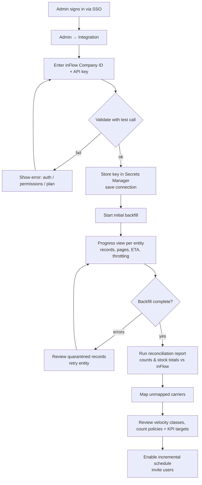

### 11.2 Executive: Daily Review and Drill-Down

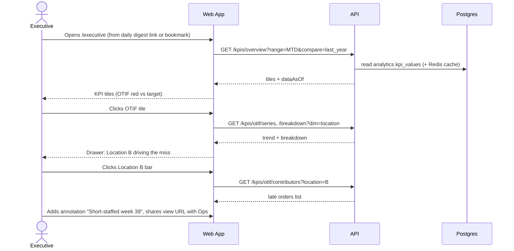

### 11.3 Planner: Forecast Review, Override, and Replenishment

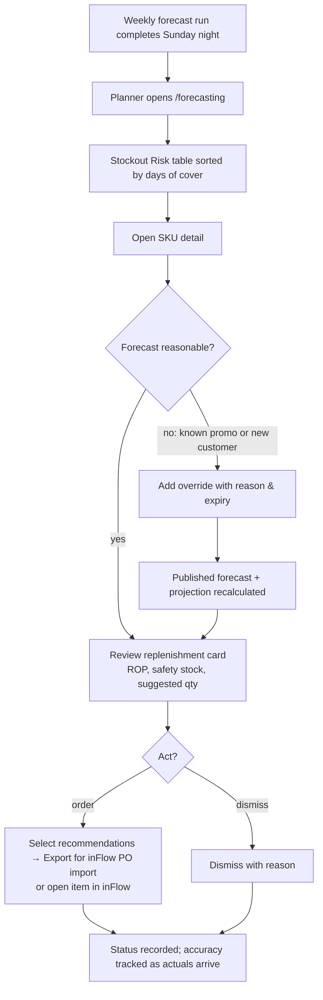

### 11.4 Inventory Lead: Velocity-Based Count Scheduling

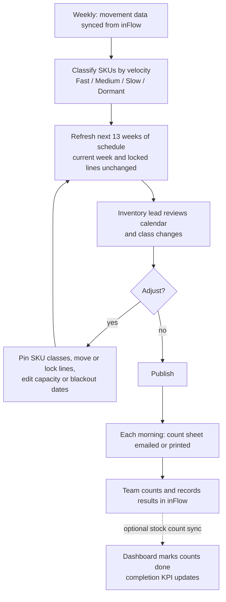

### 11.5 Purchasing Manager: Monthly Vendor Scorecard Review

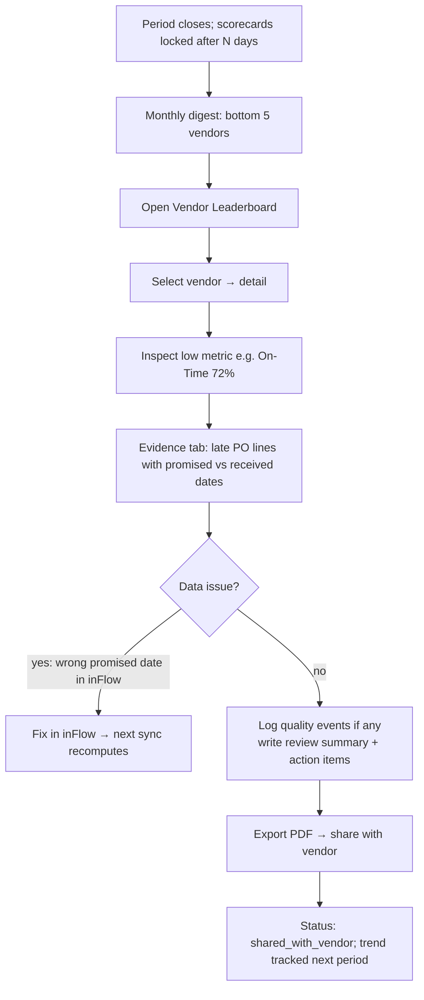

### 11.6 Alert Lifecycle

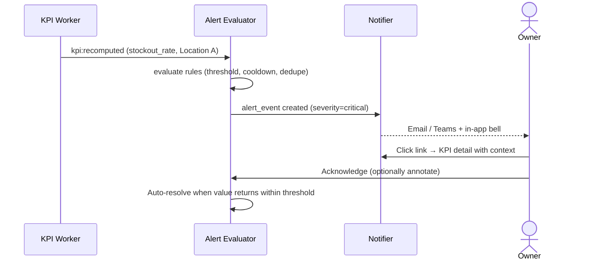

---

## 12. Security, Access Control, and Audit

### 12.1 Authentication

- OIDC SSO with the corporate IdP. MFA is enforced at the IdP.
- Short-lived access tokens (15 min) with refresh. The API validates JWT signature, audience, and issuer.

### 12.2 Role-Based Access Control

| Capability | Admin | Executive | Ops Mgr | Planner | Inv. Lead | Viewer |
|---|:-:|:-:|:-:|:-:|:-:|:-:|
| View executive & KPI pages | ✓ | ✓ | ✓ | ✓ | ✓ | ✓ |
| Set KPI targets / annotate | ✓ | ✓ | annotate | – | – | – |
| View forecasts | ✓ | ✓ | ✓ | ✓ | ✓ | ✓ |
| Override forecasts, run forecast | ✓ | – | – | ✓ | – | – |
| Manage replenishment recs | ✓ | – | ✓ | ✓ | – | – |
| View count schedule, print count sheets | ✓ | ✓ | ✓ | ✓ | ✓ | ✓ |
| Build/publish count schedules, override velocity class | ✓ | – | ✓ | – | ✓ | – |
| View scorecards | ✓ | ✓ | ✓ | ✓ | – | ✓ |
| Log quality events / claims, review scorecards | ✓ | – | ✓ | ✓ | – | – |
| Edit templates, policies, users, integration, flags | ✓ | – | – | – | – | – |

Row-level scoping by `user_location_access` is applied in the query layer for every location-dimensioned read.

### 12.3 Data Protection

- TLS 1.2+ everywhere. RDS, S3, and Redis are encrypted at rest (KMS).
- The inFlow API key and tracking keys live only in Secrets Manager and are read by workers at runtime. Keys are rotatable without a deploy.
- Webhooks: HMAC signature verification, timestamp tolerance, and replay protection via `webhook_inbox` uniqueness.
- Principle of least privilege: separate DB roles for the API (no DDL), workers, migrations, and a read-only reporting role.
- OWASP ASVS L2 controls: CSRF protection for cookie sessions, strict CSP, input validation via shared Zod contracts, rate limiting on the API.
- **Audit log** for all writes: targets, overrides, policies, count schedules, user and role changes, and integration settings.

---

## 13. Non-Functional Requirements

| Category | Requirement |
|---|---|
| Performance | Dashboard API p95 < 500 ms for KPI reads; page interactive < 2 s p95; forecast run for 50k series < 30 min |
| Freshness | Operational entities ≤ 15–30 min stale in business hours; KPIs for prior day final by 06:00 local |
| Availability | 99.5% monthly for the web/API (business-critical but not transactional). Sync can tolerate hours of inFlow outage with automatic catch-up. |
| Scalability | Designed for 50k SKUs × 10 locations, 1M order lines/year without architecture change |
| Backup / DR | RDS automated backups + PITR (7–35 days); daily snapshot copied cross-region; RPO 15 min, RTO 4 h. Raw payloads allow rebuild of core and analytics. |
| Observability | Traces across API → queue → worker → inFlow; metrics for sync lag per entity, API throttle rate, job failures, KPI compute duration; dashboards and paging on sync lag > 2 h or DLQ growth |
| Accessibility | WCAG 2.1 AA; color-blind-safe status palette (icons + color); keyboard navigable |
| Browser support | Latest two versions of Chrome, Edge, Safari, Firefox; responsive layouts on tablet and phone browsers |
| Localization | Single locale and currency at launch; currency and timezone are stored, not assumed |

---

## 14. Testing Strategy

| Level | Approach |
|---|---|
| Unit | KPI calculators, scoring normalization, velocity and ABC classifiers, schedule generator (property-based tests: capacity never exceeded, every count inside its placement window or flagged, blackout dates respected), replenishment math |
| Contract | Recorded inFlow API fixtures (sanitized) validate normalizers; Zod contracts shared across web/API; a nightly canary against the live API in staging detects schema drift |
| Integration | Testcontainers Postgres + Redis; full sync → normalize → KPI pipeline on a fixture company |
| Data quality | Automated checks after each sync: row counts vs inFlow, FK orphans, negative quantities, PO lines without promised date, unmapped carriers. Results go to the admin page. |
| KPI validation | **Golden dataset**: finance/ops-verified expected values for a closed month. CI fails if any KPI deviates. |
| Forecast | Backtest regression: WAPE on a frozen benchmark set must not degrade beyond tolerance on model changes |
| End-to-end | Playwright: executive drill-down, schedule build → publish → export count sheet, override → recompute, scorecard export |
| Performance | k6 load tests on KPI endpoints with production-like volumes |
| UAT | Each phase ends with stakeholder UAT against acceptance criteria |

---

## 15. Implementation Plan

**Assumed team:** 1 tech lead/architect, 2 full-stack engineers, 1 data/forecasting engineer (~50%, full-time in Phase 5), 1 product designer (~50%), QA embedded. **Total: about 22–26 weeks** to full rollout, with a usable executive MVP at about week 10.

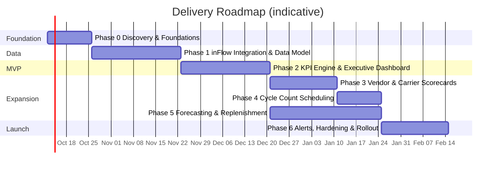

*Phase 5 runs in parallel with Phases 3–4, staffed by the data/forecasting engineer plus one full-stack engineer for the UI in its later weeks.*

---

### Phase 0 — Discovery and Foundations (2 weeks)

**Objective:** Remove the big unknowns, agree on definitions, and stand up the skeleton.

1. **inFlow API spike.** With a test company and API key, confirm the authentication, versioning header, pagination, modified-since filtering, `include` expansions, rate limits, webhook availability, and whether completed stock counts can be read (for schedule adherence). Document the actual entity coverage against §6.2 and update assumptions A2–A4.
2. **Data audit.** Pull a sample of POs, SOs, and MOs. Measure how often promised dates, carrier fields, tracking numbers, and costs are populated. Produce a **data readiness report** (for example, "38% of POs lack a vendor-promised date"), which sets expectations and process changes.
3. **KPI definition workshop** with executives. Finalize the catalog (§8.1), formulas, owners, targets, fiscal calendar, and timezone. Sign off on the **KPI Dictionary** (`docs/kpi-dictionary.md`).
4. **Scorecard and cycle-count policy workshop.** Set scorecard weights and grace days, velocity class cutoffs and cadences, and daily counting capacity and blackout dates per location.
5. **Choose a tracking aggregator** (EasyPost, ShipEngine, or AfterShip) based on carrier coverage and cost.
6. **Repo and platform skeleton.** Monorepo, lint/format/typecheck, CI pipeline, Terraform for dev/staging (VPC, RDS, Redis, ECS, S3, Secrets Manager), and a hello-world deploy of web + api + worker.
7. **SSO integration** with the corporate IdP. Base RBAC roles.
8. **Design system and wireframes.** Low-fidelity wireframes for the Executive Overview, KPI detail, scorecard detail, and count calendar, validated with 2–3 target users.

**Deliverables:** API spike report, data readiness report, signed-off KPI dictionary, policy decisions, ADRs 001–007 ratified, deployed skeleton with SSO.
**Exit criteria:** No unresolved blocker on API coverage; stakeholders have approved KPI definitions; CI/CD deploys to staging on merge.

---

### Phase 1 — inFlow Integration and Core Data Model (4 weeks)

**Objective:** A reliable, observable pipeline that mirrors inFlow into `raw` and `core` and builds history.

1. Implement `app`, `raw`, and `core` schema migrations (§7.3–7.5) and `analytics.dim_date` with the fiscal calendar.
2. Build the **inFlow API client**: auth, versioned headers, pagination, typed responses, error taxonomy.
3. Build the **Redis token-bucket rate limiter** with priority lanes, retries/backoff, circuit breaker, and DLQ.
4. Build the **sync orchestrator**: per-entity jobs, dependency ordering, resumable backfill with page checkpoints, incremental watermarks with overlap.
5. Write **normalizers** for each entity (raw → core): Zod validation, FK resolution, soft deletes, quarantine path.
6. Build the **inventory movement ledger** derivation from receipts, shipments, MOs, adjustments, and transfers.
7. Add the **nightly inventory snapshot** job and the **nightly reconciliation** job with a report.
8. Add the webhook receiver (if supported) as targeted-fetch hints.
9. Build the **Admin → Integration UI**: connection setup, sync status per entity, run log, manual trigger, quarantined records, reconciliation report.
10. Run **data quality checks** after each sync and surface them in admin.
11. Execute the **production backfill** in staging against the real company (read-only) and validate totals with ops/finance.

**Deliverables:** Running sync in staging with full history; admin integration pages; data quality dashboard.
**Exit criteria:** Reconciliation shows ≥ 99.9% record parity and stock-on-hand totals matching inFlow per location; incremental lag < 15 min for 5 consecutive business days; zero unhandled DLQ items.

---

### Phase 2 — KPI Engine and Executive Dashboard: MVP (4 weeks)

**Objective:** Executives use the dashboard daily.

1. Add `analytics.kpi_definitions`, `kpi_targets`, `kpi_values`, and `kpi_annotations` migrations. Seed the catalog from the KPI dictionary.
2. Build the **KPI calculator framework** (registry, SQL templates, numerator/denominator, grains, dimensions) and implement the inventory, sales, fulfillment, purchasing, and manufacturing KPIs.
3. Add recompute triggers (post-sync, nightly finalize, backfill on version bump) and a Redis read cache with invalidation on recompute.
4. Build the **golden dataset test** for one closed month, signed off by finance/ops.
5. Implement the KPI API endpoints (§9.2), including contributors/drill-through and the `dataAsOf` contract.
6. Frontend: app shell, global filters (URL-synced), Data Freshness badge, **Executive Overview**, **KPI domain pages**, **KPI detail** with target editor and annotations, and drill-down drawer with deep links to inFlow documents.
7. Add saved views and CSV/XLSX export from tables.
8. Production environment: Terraform prod, backups/PITR, monitoring and alerting on sync lag, Sentry.
9. **Pilot release** to 3–5 executives. Gather feedback for 1 week and iterate.

**Deliverables:** Production MVP with the executive overview and all domain KPIs.
**Exit criteria:** Golden-dataset KPIs match within 0.5%; p95 KPI API < 500 ms; pilot executives confirm the numbers match their expectations (or discrepancies are explained and documented).

---

### Phase 3 — Vendor and Carrier Scorecards (3 weeks)

**Objective:** Objective, evidence-backed supplier and carrier performance management.

1. Add migrations for the scorecard templates, metrics, results, metric results, `ops.vendor_quality_events`, `ops.carrier_claims`, and `ops.scorecard_reviews`.
2. Build the **scoring engine**: metric calculators, normalization methods, weights, grading, minimum sample handling, provisional/locked periods, rank and trend.
3. Implement **vendor metrics** (OTD, in-full, lead-time reliability, PPV, quality).
4. Add **carrier alias mapping** plus an admin queue for unmapped values.
5. Build the **tracking aggregator integration**: register tracking numbers, webhook ingestion, hourly poll fallback, `shipment_events`, and delivered/exception status. Backfill tracking for the trailing 90 days where the provider allows it.
6. Implement **carrier metrics** (OTD, transit reliability, claims rate, cost efficiency, tracking compliance).
7. Frontend: leaderboards, detail pages with metric breakdown and evidence tables, quality event and claims forms, review notes, and the **PDF export**.
8. Add the template editor in admin (weights must sum to 100, versioned).
9. Add the monthly scorecard digest email.

**Deliverables:** Vendor and carrier scorecards in production, with PDF export.
**Exit criteria:** Purchasing has validated 5 vendors' scores against their own records; at least 90% of shipments in the trailing 30 days have delivery status; carriers are fully mapped.

---

### Phase 4 — Cycle Count Scheduling (2 weeks)

**Objective:** A velocity-based count schedule the warehouse team can follow, while counting itself stays in inFlow.

1. Add migrations for the `ops` velocity and count schedule tables. Seed velocity cutoffs, cadences, and calendars from the Phase 0 decisions.
2. Build the weekly **velocity classification** job (transactions or units, cumulative-share cutoffs, the stability rule) and SKU overrides.
3. Build the **schedule generator** (§8.3) with property-based tests, the preview API, and the weekly rolling refresh.
4. Frontend: count calendar, **Schedule Builder wizard** with drag-and-drop preview, and the velocity page.
5. Build **count sheet exports** (PDF/CSV/XLSX, walk-ordered, blind by default) and the optional morning email.
6. If the Phase 0 spike confirmed that completed inFlow stock counts can be read: match them to schedule lines, build the adherence view, and add the Count Schedule Completion KPI.
7. Publish the first schedule at a **pilot location**. The pilot runs into Phase 6, comparing planned daily load with what the team actually finishes, and capacity is tuned from that.

**Deliverables:** A published 13-week count schedule for the pilot location; daily count sheets.
**Exit criteria:** Every fast SKU is scheduled once per week, every medium SKU once per two weeks, and every slow SKU once per four weeks (or the shortfall is flagged and acknowledged); no day exceeds capacity; the inventory lead signs off on the first published schedule.

---

### Phase 5 — Forecasting and Replenishment (5 weeks, parallel with Phases 3–4)

**Objective:** Forward-looking demand and stockout visibility with actionable reorder recommendations.

1. Stand up the **Python forecasting worker** (container, queue consumer, DB access, structured logging, progress reporting).
2. Build the **demand history** (requested-ship-week demand, dependent demand via BOM explosion, stockout-week imputation).
3. Build **demand classification** and candidate model sets. Add the **rolling-origin backtest** harness and per-series model selection.
4. Produce **probabilistic output** (p10/p50/p90), bulk-write forecasts, and a forecast series metadata table.
5. Apply **overrides** and build `forecast_published`.
6. Compute **lead-time statistics** from PO receipt history (shared with vendor scorecards).
7. Build the **replenishment engine**: safety stock by ABC service level, ROP, EOQ/MOQ/pack rounding, inventory projection, projected stockout date.
8. Build **forecast accuracy** tracking by lag. Feed the Forecast Accuracy KPI.
9. Frontend: forecast overview, item detail (forecast chart with bands, projection chart, model card, override editor), replenishment table with bulk actions, and **export formatted for inFlow PO import**.
10. Add the weekly scheduled run and the manual run with progress UI.
11. **Validation:** Planners review the top 100 SKUs by value for 2 forecast cycles, compared against their current method.

**Deliverables:** Weekly forecasts, replenishment recommendations, accuracy tracking.
**Exit criteria:** Backtest WAPE for A-class SKUs beats the seasonal-naive baseline by at least 15% (target set with planners in Phase 0); bias within ±5%; a full run completes within the SLA.

---

### Phase 6 — Alerts, Hardening, and Organization-Wide Rollout (3 weeks)

**Objective:** Proactive notifications, production hardening, and adoption.

1. Build the **alerting** engine: rule types, evaluation after recompute, cooldown/dedupe, in-app + email + Teams/Slack adapters, acknowledgment, and auto-resolve.
2. Add **digests**: daily executive summary, weekly ops, and monthly scorecards.
3. **Performance pass:** query plans, indexes, materialized views, cache tuning, and k6 load tests at 2× expected volume.
4. **Security review:** dependency audit, pen test of auth/RBAC and webhooks, secret rotation drill, audit-log completeness check.
5. **DR drill:** restore from PITR into a fresh environment; rebuild analytics from raw.
6. Write **runbooks**: sync lag, inFlow outage, DLQ handling, forecast run failure, KPI backfill.
7. **Training and documentation:** role-based quick guides, the in-app KPI definitions, and a one-page guide to reading and printing count schedules.
8. **Rollout:** count schedules for all locations, and all user groups. Hypercare for 2 weeks with daily triage.

**Deliverables:** Production-hardened platform, alerts and digests, runbooks, trained users.
**Exit criteria:** All NFRs (§13) met in load and DR tests; no open Sev-1/Sev-2 defects; at least 80% of target users active weekly by the end of hypercare.

---

### Post-Launch Backlog (candidates)

- Promotions and causal factors in forecasting (ML models such as LightGBM with exogenous features).
- Multi-echelon inventory optimization across locations, and transfer recommendations.
- Vendor portal for scorecard sharing and promise-date confirmation.
- Direct PO creation in inFlow from approved recommendations (needs a new ADR, since the integration is read-only today).
- Exception counts added to the velocity schedule (negative on-hand, large unexplained adjustments).
- Inventory record accuracy KPI built from inFlow count results.
- Read-only semantic layer for Power BI/Excel.
- Capacity/labor KPIs for manufacturing if routing/labor data becomes available.

---

## 16. Risks and Mitigations

| # | Risk | Likelihood | Impact | Mitigation |
|---|---|:-:|:-:|---|
| R1 | inFlow API lacks an entity or field we need (for example receipt dates per line, MO completion dates, stock adjustment history) | Med | High | Phase 0 spike before committing; fallback to scheduled CSV export ingestion; adjust KPI scope early |
| R2 | API rate limits throttle backfill or freshness | Med | Med | Shared token bucket, hash-based skipping, include-expansions to cut calls, off-hours backfill, adaptive polling intervals |
| R3 | Poor source data quality (missing promised dates, free-text carriers, inconsistent costs) | High | High | Data readiness report in Phase 0; data-quality dashboard; process fixes in inFlow; scorecards show "insufficient data" instead of misleading scores |
| R4 | Executives dispute KPI numbers, eroding trust | Med | High | Signed-off KPI dictionary, golden dataset tests, numerator/denominator transparency, drill-to-document, annotations |
| R5 | Insufficient history for reliable forecasts | Med | Med | Demand classification, low-confidence flags, category-level fallbacks, planner overrides, accuracy tracked visibly |
| R6 | Velocity classes change often, so the schedule keeps shifting | Med | Med | 90-day lookback, demotions only after two agreeing weekly runs, current week and locked lines never re-planned, manual class pins |
| R7 | The schedule isn't followed, since counting happens in inFlow outside the dashboard | Med | Med | Morning count sheets by email, realistic capacity tuned in the pilot, adherence tracking from inFlow stock counts where available |
| R8 | Tracking aggregator coverage or cost for regional/LTL carriers | Med | Med | Choose provider by coverage in Phase 0; manual delivery entry fallback; LTL proof-of-delivery import |
| R9 | inFlow API version changes break sync | Low | Med | Pinned version header, contract tests, nightly staging canary, quarantine path instead of crash |
| R10 | Scope creep toward a full BI tool | Med | Med | Non-goals stated; export and read-only reporting role as a pressure valve |

---

## 17. Open Questions for Stakeholders

1. Which inFlow plan and edition is in use, and is API access enabled? Who owns the API key?
2. How many locations and sublocations (bins), active SKUs, and orders per month are there today?
3. Fiscal calendar: calendar months or 4-4-5? Fiscal year start? Business timezone(s)?
4. Do vendors confirm promised dates, and are they entered on POs in inFlow today?
5. Which carriers are used (parcel vs. LTL vs. own fleet)? Is a shipping platform already in use (ShipStation, etc.) that has delivery data?
6. How are vendor quality issues recorded today (if at all)?
7. Current cycle-count practice: who counts, how many SKU-locations can be counted per day at each location, and which days are off-limits (month-end, big receiving days)?
8. Should velocity be measured by number of transactions (picks) or by units moved? We recommend transactions, because count errors happen per transaction.
9. What service-level targets (fill rate) should drive safety stock by ABC class?
10. Preferred identity provider for SSO, and preferred cloud (AWS vs. Azure)?
11. Who are the KPI owners, and which 6–8 KPIs belong on the executive overview?
12. Notification channels: email only, or Teams/Slack as well?

---

## 18. Glossary

| Term | Meaning |
|---|---|
| **ABC classification** | Ranking SKUs by annual usage value; used here to set safety-stock service levels |
| **Velocity class** | Fast / Medium / Slow / Dormant, based on how often a SKU moves; sets how often it is counted |
| **XYZ classification** | Ranking SKUs by demand variability (X stable … Z erratic) |
| **OTIF** | On-Time In-Full delivery |
| **WAPE** | Weighted Absolute Percentage Error: Σ\|actual − forecast\| ÷ Σ actual |
| **Bias** | Σ(forecast − actual) ÷ Σ actual; positive means over-forecasting |
| **ROP** | Reorder point: inventory position that triggers a replenishment order |
| **EOQ** | Economic Order Quantity |
| **PPV** | Purchase Price Variance |
| **Watermark** | Last successfully synced modification timestamp per entity |
| **DLQ** | Dead-letter queue: jobs that exhausted retries and need human review |
| **Blind count** | A count where the counter can't see the system quantity (the default for count sheets) |
