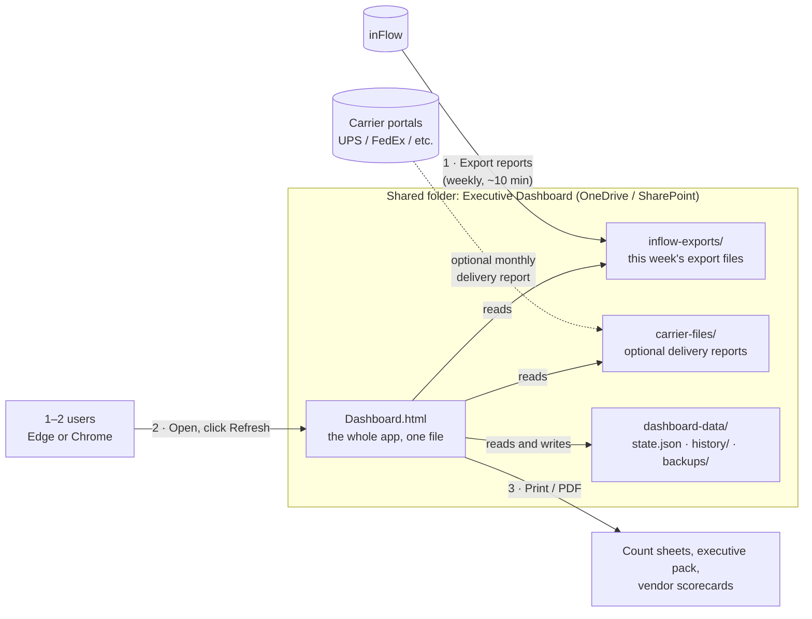
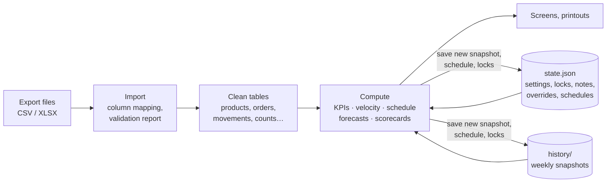
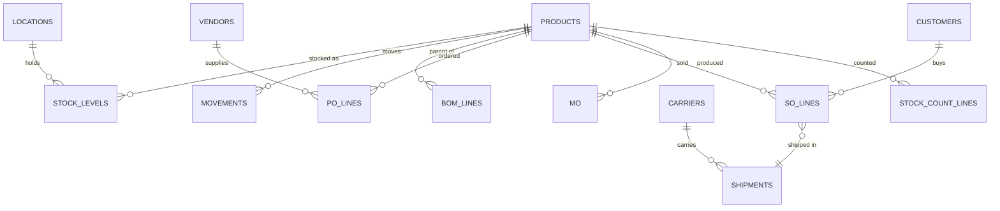
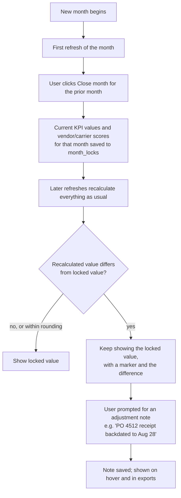
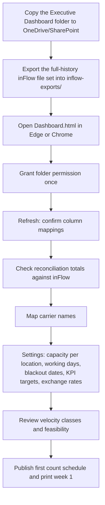
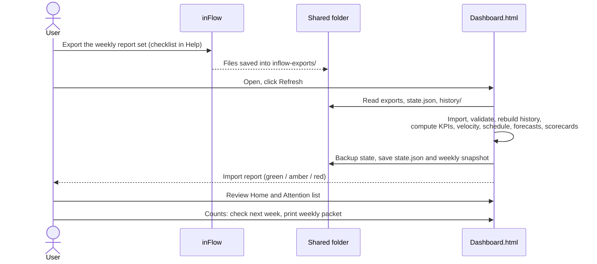
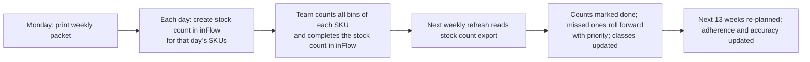
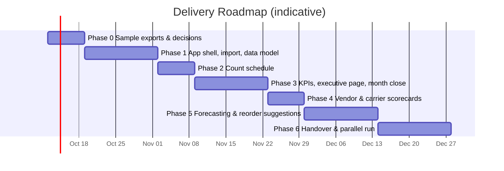

# Executive Operations Dashboard — System Design Document

| | |
|---|---|
| **Status** | Draft v2.0 — replaces v1.0 (see [What changed in v2](#1-what-changed-in-v2)) |
| **Date** | 2026-10-01 |
| **Scope** | KPIs, demand forecasting, cycle count schedules, vendor scorecards, carrier scorecards |
| **Data source** | inFlow Inventory / inFlow Manufacturing **file exports** (CSV/XLSX) |
| **Users** | 1–2 people, full access |
| **Operating model** | No tech team. Built once and handed over. The only routine task is uploading data files. |

---

## Table of Contents

1. [What changed in v2](#1-what-changed-in-v2)
2. [Goals, Non-Goals, and Constraints](#2-goals-non-goals-and-constraints)
3. [Architecture](#3-architecture)
4. [Technology Choices](#4-technology-choices)
5. [Data Inputs: inFlow Exports](#5-data-inputs-inflow-exports)
6. [Data Model](#6-data-model)
7. [Functional Modules](#7-functional-modules)
8. [Screen and Component Hierarchy](#8-screen-and-component-hierarchy)
9. [User Flows](#9-user-flows)
10. [Security and Data Protection](#10-security-and-data-protection)
11. [Designing for Zero Maintenance](#11-designing-for-zero-maintenance)
12. [Implementation Plan](#12-implementation-plan)
13. [Risks and Mitigations](#13-risks-and-mitigations)
14. [What Is Needed From You to Start](#14-what-is-needed-from-you-to-start)
15. [Glossary](#15-glossary)

---

## 1. What changed in v2

v1 assumed a development team to run a cloud platform: servers, a database, job queues, an API integration, single sign-on, and monitoring. That is the wrong shape for a 1–2 person audience with no one to maintain it. v2 is built around the answers to the design review:

| Decision | Answer | Design consequence |
|---|---|---|
| What is one count? | One SKU. All of its bins are counted in the same count. | Count lines and daily capacity are measured in **SKUs per day** at a location. |
| How are counts recorded? | inFlow's Stock Count function | The inFlow stock count export supplies **last-counted dates** and **schedule adherence**. |
| Who uses it? | 1–2 people who see everything | No logins, roles, or row-level permissions. Access is controlled by who can open the shared folder. |
| Is inFlow data reliable? | Yes, all of it | Full history is used. Past stock levels are rebuilt from movement history (§7.2). |
| Edits to closed months? | Lock, with an adjustment note | **Month close** freezes KPI and scorecard values; later differences are shown with a required note (§7.2). |
| Maintenance capacity | None. Uploading data files is the extent of it. | **No servers, no API connection, no accounts.** A single self-contained HTML file reads inFlow exports from a folder. |

**The main trade-off:** The live inFlow API connection is dropped. An API connection needs a server running all the time, a stored API key, and someone to fix it when inFlow changes something. The cost of dropping it is a **10-minute weekly routine**: export a set of files from inFlow, drop them in a folder, and click Refresh. The dashboard is a weekly management tool, and the count schedule is planned weekly, so weekly data matches how it is used.

Removed from v1: cloud hosting (AWS, ECS, RDS, Redis), Terraform, the inFlow API sync and webhooks, the carrier tracking API, single sign-on and roles, the audit log, email alerts and digests, and the separate Python forecasting service. Most v1 review findings about security, scale, and stack weight no longer apply. The data-logic findings are resolved in §7.

---

## 2. Goals, Non-Goals, and Constraints

### 2.1 Goals

- **G1 — One trusted set of numbers.** Every KPI has one written definition shown in the app.
- **G2 — Weekly refresh in about 10 minutes.** Export, drop in a folder, click Refresh.
- **G3 — Drill from number to document.** Any KPI or score opens a list of the orders, receipts, or shipments behind it.
- **G4 — Forward-looking.** Demand forecasts, projected stockouts, and reorder suggestions.
- **G5 — A count schedule the team can follow.** Velocity-based, within daily capacity, printed as daily count sheets.
- **G6 — Runs for years untouched.** No server, no subscriptions, nothing to patch, nothing that expires.

### 2.2 Non-Goals

- Live or real-time data. Data is as fresh as the last upload.
- Writing anything into inFlow. Counts are done and recorded in inFlow, and reorder suggestions are acted on there.
- Automatic emails or alerts. No server exists to send them. The home page has an **Attention** list instead, and any page can be printed or saved as PDF to share.
- Multiple simultaneous editors. Two users can share it, but not edit at the same moment (§6.5).

### 2.3 Constraints

| # | Constraint |
|---|---|
| C1 | Must run on a normal office PC in **Microsoft Edge or Google Chrome** (desktop). No installation, no admin rights. |
| C2 | All files live in a folder the users already have, such as OneDrive, SharePoint, Google Drive for desktop, or a network share. |
| C3 | No external services at runtime. Every library is embedded in the HTML file, so it works offline and can't break when a website changes. |
| C4 | Volume assumption: up to ~10,000 active SKUs, ~5 locations, ~150,000 order lines per year, and 5+ years of history. |

---

## 3. Architecture

### 3.1 How It Fits Together



There is no server. The HTML file is the application. When it's opened, it asks once for permission to use the folder, then reads the export files, computes everything in the browser, and saves its settings and history back into the same folder.

### 3.2 Processing Pipeline (inside the browser)



Every refresh recomputes from the files, so a fix to a formula applies to all history automatically. The only things that must be kept are those that can't be recomputed: settings, notes, overrides, locked month values, published schedules, and weekly snapshots. They live in `dashboard-data/`.

### 3.3 Weekly Routine

| Step | Who | Time |
|---|---|---|
| Export the standard report set from inFlow (a saved checklist is in the app's Help page) into `inflow-exports/`, replacing last week's files | User | ~5 min |
| Open `Dashboard.html` and click **Refresh** | User | ~1 min |
| Read the import report (green = fine; amber/red explains what's wrong) | User | ~1 min |
| Review the Attention list and next week's count schedule, then print count sheets | User | ~5 min |
| **First week of a month:** click **Close month** for the prior month | User | ~2 min |

---

## 4. Technology Choices

The delivered product is **one HTML file**. The builder uses ordinary development tools, but none of them are needed to run or use the dashboard.

| Concern | Choice | Why |
|---|---|---|
| Delivered format | Single self-contained `Dashboard.html` (all code, styles, and libraries embedded, ~3 MB) | Nothing to install or host. Copy it anywhere. Works offline. |
| Folder access | Browser **File System Access API** (Edge/Chrome), with a drag-and-drop and "download state file" fallback | Lets the app read exports and save state directly in the shared folder after a one-time permission prompt. |
| Language (build time) | TypeScript, bundled to one file (Vite with a single-file plugin) | Type safety for the calculation code. The user never sees it. |
| UI | Preact (small React-compatible library) + plain CSS | Small, stable, and nothing to update. |
| CSV / Excel reading | PapaParse (CSV) and SheetJS (XLSX), embedded | Handles inFlow's CSV and Excel exports, including quoted fields and dates. |
| Charts | Apache ECharts, embedded | Handles forecast bands, calendars, and heatmaps. Prints cleanly. |
| Heavy computation | Web Workers | Forecasting and history rebuilds run off the main thread, so the page stays responsive. |
| PDF output | Browser **Print → Save as PDF** with print-specific layouts | No PDF library to maintain, and it looks the same on paper. |
| Data storage | JSON state file + compressed CSV snapshots in the shared folder | Human-readable, backed up by OneDrive/SharePoint version history, and easy to inspect. |
| Self-test | Built-in **Self-check** button that runs known-answer tests on bundled sample data | If a future browser update ever breaks something, the user can see it immediately. |

**Not used, on purpose:** No external CDN links (a library website going away can't break the app). No browser-only storage for anything important (clearing browser data must not lose anything). No database engine, server, or cloud account.

---

## 5. Data Inputs: inFlow Exports

### 5.1 Required and Optional Files

The exact inFlow report names and columns **must be confirmed in Phase 0** from real exports. The table lists what the dashboard needs, not inFlow's report titles.

| # | File (role) | Must contain | Used by | Required? |
|---|---|---|---|---|
| F1 | Products | SKU, name, category, item type, UoM, cost, price, preferred vendor, active flag, reorder settings | Everything | Yes |
| F2 | Locations / stock levels | SKU, location, sublocation (bin), qty on hand, qty reserved/committed, qty on order | Inventory KPIs, count sheets, replenishment | Yes |
| F3 | Inventory movement history | Date, SKU, location, qty in/out, transaction type, source document # | Velocity, history rebuild, turns | Yes |
| F4 | Sales orders with lines | Order #, customer, location, order date, requested/promised ship date, status, line SKU, qty, price, cost, shipped qty, ship date, carrier/shipping method, tracking #, freight | Sales and fulfillment KPIs, demand history, carrier volume | Yes |
| F5 | Purchase orders with lines and receipts | PO #, vendor, location, order date, promised/due date, status, line SKU, qty ordered, unit cost, currency, qty received, receive date | Purchasing KPIs, vendor scorecards, lead times | Yes |
| F6 | Manufacturing (work) orders | MO #, product, qty planned/completed, start, due, completion date, status, components consumed | Manufacturing KPIs, component demand | Yes, if manufacturing is used |
| F7 | Bills of materials | Parent SKU, component SKU, qty per | Component demand for forecasting | Yes, if manufacturing is used |
| F8 | Stock counts | Count #, location, completed date, status, SKU, counted qty, system qty | Last-counted dates, schedule adherence, count accuracy | Yes |
| F9 | Vendors | Vendor name, code, default lead time, currency | Vendor scorecards | Yes |
| C1 | Carrier delivery report(s) | Tracking #, ship date, delivered date, service, charges | Carrier on-time delivery | Optional (§7.6) |

If inFlow has one export that covers several of these roles (for example, a sales report with lines and shipping), it's used as is. Any export with **full history** only needs to be supplied in full once; after that, weekly exports can cover just the last 90 days, and the app merges them into history (§6.3).

### 5.2 Import and Column Mapping

- **Saved column mappings.** The first time a file is loaded, the app recognizes inFlow's column headings automatically. Anything it can't match is shown on a mapping screen ("Which column is Received Date?"). Mappings are saved, so if inFlow renames a column later, the user fixes it from a dropdown. No code change is needed.
- **Validation report after every refresh:**
  - **Green:** row counts, date range, and totals (for example, total on-hand value) per file.
  - **Amber:** data issues that limit a metric, such as PO lines with no promised date, shipments with no carrier, or SKUs on orders that aren't in Products.
  - **Red:** a missing required file or column, or an export older than the others. Calculations that depend on it are paused and the screen says why.
- **Reconciliation figures** on the import page, such as on-hand value by location and open PO value, can be checked against the same totals in inFlow.

---

## 6. Data Model

There is no database server. The data model has three layers: **imported tables** (rebuilt from files on every refresh), **derived tables** (computed on every refresh), and **persisted state** (saved to the folder, the only data that must be kept).

### 6.1 Imported Tables (in memory, rebuilt each refresh)



| Table | Key | Main fields | Source |
|---|---|---|---|
| `products` | sku | name, category, item_type, uom, cost, price, preferred_vendor, is_active, reorder_point_inflow | F1 |
| `locations` | location | name, timezone (from settings) | F2 |
| `stock_levels` | sku + location + bin | on_hand, reserved, on_order, unit_cost | F2 |
| `movements` | row id | date, sku, location, bin, qty (signed), type (`sale, receipt, mo_consume, mo_produce, transfer_in, transfer_out, adjustment, count_adjustment, return`), doc_number | F3 |
| `so_lines` | order # + line | customer, location, order_date, requested_ship, promised_ship, status, sku, qty, price, cost_at_sale, shipped_qty, ship_date, carrier_raw, tracking, freight | F4 |
| `po_lines` | PO # + line | vendor, location, order_date, promised_date, status, sku, qty_ordered, unit_cost, currency, qty_received, first_receipt_date, last_receipt_date | F5 |
| `mo` | MO # | sku, location, qty_planned, qty_completed, start, due, completed_date, status | F6 |
| `mo_components` | MO # + sku | qty_required, qty_consumed | F6 |
| `bom_lines` | parent + component | qty_per | F7 |
| `stock_count_lines` | count # + sku + bin | location, completed_date, status, counted_qty, system_qty | F8 |
| `vendors` | vendor | code, default_lead_time_days, currency | F9 |
| `shipments` | tracking # (or order # + ship date) | carrier (mapped), service, ship_date, delivered_date, freight | F4 + C1 |

### 6.2 Derived Tables (computed each refresh)

| Table | Grain | Main fields |
|---|---|---|
| `inventory_history` | week × sku × location | on_hand, value. Rebuilt backwards from current on-hand using movements (§7.2) |
| `kpi_values` | KPI × period (week/month) × dimension (company/location/category/vendor/carrier) | value, numerator, denominator, sample_size, locked_value, adjustment_note_id |
| `velocity` | sku × location | transactions_90d, units_90d, rank, cumulative_pct, computed_class, final_class (after overrides and the stability rule) |
| `count_plan` | sku × location × date | due_date, scheduled_date, class, walk_order (first bin path), status (`scheduled, done, late, missed, at_risk`) |
| `abc_class` | sku | annual usage value, A/B/C (used for forecasting service levels) |
| `forecast` | sku × location × week (26 weeks ahead) | p10, p50, p90, model, demand_class, backtest_error, low_confidence |
| `replenishment` | sku × location | avg weekly demand, lead time (mean and variation), safety stock, reorder point, suggested qty, projected stockout date, days of cover |
| `vendor_scores` | vendor × month | metric values, normalized scores, overall score, grade, rank, sample size |
| `carrier_scores` | carrier × month | metric values, normalized scores, overall score, grade |

### 6.3 Persisted State (`dashboard-data/`)

This is the only data that must survive between sessions. All of it is plain files in the shared folder.

**`dashboard-data/state.json`**

| Section | Contents |
|---|---|
| `meta` | file format version, last refresh time, last saved by (user's name, typed once), revision number |
| `settings.company` | fiscal calendar (calendar months or 4-4-5), fiscal year start, timezone per location, base currency and fixed exchange rates per currency (edited when needed) |
| `settings.counts` | velocity window (90 days), metric (`transactions`), class cutoffs (80% / 95%), cadence per class (fast 1 wk, medium 2 wk, slow 4 wk, dormant 52 wk), placement window per class, demotion rule (2 runs), working days, **daily capacity (SKUs/day) per location**, blackout dates |
| `settings.kpis` | which KPIs are on the executive page, targets and warning thresholds per KPI |
| `settings.forecast` | service level per ABC class, horizon, default lead time |
| `settings.scorecards` | vendor and carrier metrics, weights (sum = 100), targets, floors, grace days, minimum sample size, grade scale |
| `column_mappings` | per file role: inFlow column heading → field |
| `carrier_aliases` | free-text carrier/shipping-method values → carrier and service level |
| `velocity_overrides` | sku, location, forced class, reason, expiry |
| `velocity_history` | last 4 weekly class assignments per sku × location (drives the demotion rule) |
| `count_schedule` | published weeks: per sku × location, scheduled date and locked flag. Weeks already printed are fixed. |
| `month_locks` | per closed month: locked KPI values and vendor/carrier scores, closed date, closed by |
| `adjustment_notes` | month, KPI or scorecard, locked value, current recalculated value, difference, note text, author, date |
| `forecast_overrides` | sku, location, week range, absolute or %, reason, expiry |
| `forecast_snapshots` | lag-1 and lag-4 week forecast per sku × location for the last 13 weeks, plus weekly accuracy summaries by ABC class (kept indefinitely) |
| `quality_events` | vendor, PO #, sku, type (defect, damage, wrong item, paperwork), qty affected, cost, date, note |
| `carrier_claims` | carrier, tracking/order #, type (damage, loss, delay), amount claimed/recovered, dates |
| `recommendation_status` | sku × location: reviewed / dismissed (with reason), date |

**`dashboard-data/history/`** — One compressed CSV per weekly refresh with on-hand by SKU × location. This is a check on the rebuilt history and a fallback if movement history is ever incomplete.

**`dashboard-data/backups/`** — Before every save, the previous `state.json` is copied to `backups/state-YYYY-MM-DD-HHMM.json`. The last 26 are kept. OneDrive/SharePoint version history is a second layer.

### 6.4 Data Volumes

At the assumed volumes (C4), five years of order lines and movements is about 1–2 million rows. To stay fast in a browser, imported tables are held **column by column** (typed arrays, with repeated text values stored once), not as millions of separate objects. Expected memory is under 500 MB, and a full refresh takes under a minute on a typical office PC. If history grows beyond this, the app keeps a configurable window (default 5 years) for detail and keeps monthly summaries for older periods.

### 6.5 Two Users, One State File

- Each user opens the same `Dashboard.html` from the shared folder.
- On save, the app re-reads `state.json`. If the revision number changed since it was loaded (the other person saved in between), it merges non-conflicting changes, such as notes and settings in different sections. If both people changed the same item, it asks which to keep. Nothing is silently overwritten.
- The top bar shows "Last refreshed by Pat, Mon 7:42 AM", so both users know which data they're looking at.

---

## 7. Functional Modules

### 7.1 KPIs

| Domain | KPI | Definition (summary) | Needs |
|---|---|---|---|
| Inventory | Inventory Value | Σ on-hand qty × unit cost at period end | F1, F2, F3 |
| Inventory | Inventory Turns | Annualized cost of goods sold ÷ average inventory value | F3, F4 |
| Inventory | Days of Inventory on Hand | Average inventory value ÷ daily cost of goods sold | F3, F4 |
| Inventory | Excess & Obsolete % | Value with no movement in 180 days, or more than 365 days of cover, ÷ total value | F3, forecast |
| Inventory | Stockout Rate | % of active stocked SKU-locations at zero available (weekly average) | Rebuilt history |
| Inventory | Count Accuracy | % of inFlow stock count lines where counted qty = system qty (within tolerance) | F8 |
| Inventory | Count Schedule Completion | Scheduled counts completed in inFlow within their placement window ÷ counts due | F8 + schedule |
| Sales | Revenue / Gross Margin % | Shipped revenue; (revenue − cost at sale) ÷ revenue | F4 |
| Sales | Backlog Value | Open sales order value not yet shipped | F4 |
| Fulfillment | Fill Rate | Units shipped on the first shipment ÷ units ordered | F4 |
| Fulfillment | Customer OTIF | Orders shipped in full by promised ship date ÷ orders due | F4 |
| Fulfillment | Order Cycle Time | Median days from order to ship | F4 |
| Purchasing | Vendor OTIF | PO lines received in full by promised date ÷ lines due | F5 |
| Purchasing | Purchase Price Variance | Σ (PO cost − standard cost) × qty, in base currency | F1, F5 |
| Purchasing | Past-Due PO Value | Open PO value past promised date | F5 |
| Manufacturing | MO Schedule Adherence | MOs completed by due date ÷ MOs due | F6 |
| Manufacturing | Production Yield | Qty completed ÷ qty planned (closed MOs) | F6 |
| Manufacturing | Throughput | Units produced per period | F6 |
| Forecasting | Forecast Accuracy / Bias | 1 − WAPE and bias at lag 1 and lag 4 weeks | Forecast snapshots |

**Calculation rules that close v1 review gaps:**

- **Roll-ups** use numerator and denominator, never an average of averages.
- **Currency:** Every amount is converted to the base currency using the exchange rates in settings. Rates are entered by the user and only change when they change them. The import report warns when a currency appears with no rate.
- **Cost of goods sold** uses the cost recorded on the sales line at the time of sale (F4). If the export doesn't include it, the app falls back to the movement cost (F3), and the KPI is labeled with the method used.
- **Returns and cancellations:** Returns reduce revenue, cost, and demand in the period they occur. Cancelled lines are excluded everywhere.
- **Time zones:** Each transaction is dated in its own location's timezone.

### 7.2 Inventory History and Month Close

**Rebuilding past stock levels.** inFlow exports only current stock. Since inFlow history is reliable, the app starts from current on-hand and walks backwards through the movement history, reversing each movement, to produce week-end on-hand for every past week. The weekly snapshot files in `history/` check the rebuild: if the rebuilt value for a past snapshot week differs from the saved snapshot by more than 0.5%, the import report flags it.

**Month close and adjustment notes:**



- Locked months always display the locked value. Reports and comparisons (month over month, year over year) use locked values.
- The difference and its note appear next to the value. A summary of all adjustments is on the Month Close page.
- Drill-down for a locked month shows the current underlying documents, and marks the ones that changed after the lock.
- Open months and weeks are always recalculated.

### 7.3 Cycle Count Schedule

The dashboard plans counts. Counting and recording happen in inFlow's Stock Count function. **One count = one SKU at one location, covering all of its bins.**

**Velocity classification** (every refresh)

1. For each SKU × location, count outbound **transactions** over the last 90 days: sales shipments, manufacturing consumption, and transfers out (from F3).
2. Rank SKUs from most to least transactions and classify them by cumulative share:

   | Class | Default rule | Cadence | Placement window |
   |---|---|---|---|
   | Fast | SKUs making up the top 80% of transactions | **Weekly** | ±2 working days, stays in its week |
   | Medium | The next 15% | **Every 2 weeks** | ±3 working days |
   | Slow | Remaining SKUs with any movement | **Monthly** (every 4 weeks) | ±5 working days |
   | Dormant | No movement in 90 days, but stock on hand | Yearly | ±10 working days |

   SKUs with no movement and no stock are left off.
3. **Overrides:** Pin any SKU to a class, with a reason and optional expiry.
4. **Stability:** Promotions take effect immediately. Demotions only happen after two weekly refreshes in a row agree.

**Last-counted date.** The most recent **completed** inFlow stock count (F8) that recorded a counted quantity for that SKU at that location. Stock counts that are open, voided, or have a blank counted quantity don't count. A SKU that appears on a count sheet but was skipped stays due.

**Building the schedule** (every refresh, for the next 13 weeks)

1. **Feasibility check.** Required SKUs per day = Σ over classes of (SKUs in class ÷ working days in its cadence). For example, 600 fast SKUs ÷ 5 days = 120/day, plus 300 medium ÷ 10 = 30/day, plus 900 slow ÷ 20 = 45/day, plus dormant ≈ 1/day, for **~196 SKUs/day**. If that exceeds capacity, the screen shows the gap and the levers: raise capacity, tighten the Fast cutoff, or lengthen a cadence. A schedule that can't keep its cadences can still be used, but the shortfall stays visible.
2. **Due date** = last-counted date + cadence. Never counted = due now.
3. **Placement:** Each count goes on the working day nearest its due date. When a day is full, it moves to the nearest day with room inside its placement window. Fast SKUs are placed first. SKUs in the same zone or aisle are grouped onto the same day when every count stays in its window. Counts that can't fit in their window are marked **at risk**, not quietly pushed later.
4. **Locking:** The current week and any week already printed are fixed. Later weeks are re-planned each refresh to account for completed counts, class changes, and new SKUs.
5. **Walk order:** Each day's list is sorted by the SKU's first bin path. All of the SKU's bins are listed on its line.

**Outputs**

- **Calendar:** counts per day against capacity, colored by class, with at-risk days highlighted.
- **Daily count sheet** (print or PDF): SKU, description, UoM, all bins, and a blank count column. System quantity is hidden by default (blind count). Header note: count fast movers before picking starts.
- **Weekly packet:** five daily sheets printed in one go.
- **CSV of the day's SKUs**, for creating the stock count in inFlow (if inFlow's stock count supports importing an item list; to confirm in Phase 0).
- **Adherence view:** done on time, done late, or missed, by class and by week. It also shows count accuracy from the counted versus system quantities in F8.

### 7.4 Forecasting and Replenishment

Runs in the browser (in a background worker) at every refresh. About 10,000 series take roughly 1–3 minutes.

1. **Demand history:** Weekly shipped quantity by requested-ship week, plus component demand from manufacturing orders and BOMs, minus returns. Weeks where the rebuilt history shows zero stock are marked as stockouts and excluded from model fitting, so lost sales don't drag the forecast down.
2. **Demand class:** smooth, erratic, intermittent, lumpy, new (< 13 weeks), or inactive.
3. **Models**, all well-established and deterministic:
   - Smooth or erratic demand: seasonal naive, simple exponential smoothing, Holt, and Holt-Winters (when there are ≥ 2 years of history).
   - Intermittent or lumpy demand: Croston (SBA) and TSB.
   - New SKUs: the category's average pattern, scaled. Flagged low-confidence.
4. **Model choice:** Backtest on the last 8 weeks for each SKU and pick the lowest weighted error, with a guard against bias. Ranges (p10/p90) come from backtest errors.
5. **Overrides** from state (for example "+30% weeks 12–15, promotion") are applied after the statistical forecast.
6. **Replenishment:**
   - ABC class (by annual usage value) sets the service level, for example A 98%, B 95%, C 90%.
   - Safety stock = z × √(lead time × demand variance + demand² × lead-time variance).
   - Lead time mean and variation come from actual PO receipts per vendor and SKU, falling back to the vendor default.
   - Reorder point = demand during lead time + safety stock. Suggested quantity rounds up to MOQ and pack size.
   - Projected stockout date = on hand + on order − forecast, week by week.
7. **Accuracy:** Each refresh saves lag-1 and lag-4 forecasts, and compares older ones to actual demand. This feeds the Forecast Accuracy KPI.

Reorder suggestions are a list to act on in inFlow, with a CSV export. Nothing is written to inFlow.

### 7.5 Vendor Scorecards (monthly)

| Metric | Calculation | Weight |
|---|---|---|
| On-Time Delivery | PO lines fully received by promised date + grace days ÷ lines due | 30 |
| In-Full | Lines where received qty ≥ 98% of ordered ÷ lines closed | 20 |
| Lead-Time Reliability | Based on variation of actual vs. expected lead time | 15 |
| Price Variance | Σ (PO cost − standard cost) × qty ÷ spend | 15 |
| Quality | 1 − (qty in quality events ÷ qty received) | 20 |

Rules for the v1 review edge cases:

- **On time means fully received on time.** The date that counts is when the line reached 98% received, not the first partial receipt.
- **Missing promised date:** The app uses the PO due date if there is one, otherwise order date + vendor default lead time. The scorecard shows how many lines used a fallback.
- **Small samples:** Vendors with fewer than 5 PO lines due in the month show "Insufficient data" instead of a score.
- Quality events are entered in the dashboard, since inFlow doesn't capture them.

Output: leaderboard, detail page with the PO lines behind each metric, and a print/PDF scorecard to send to the vendor. Closed months use locked scores (§7.2).

### 7.6 Carrier Scorecards (monthly)

inFlow records which carrier shipped an order and the tracking number, but not when it was delivered. Two levels are supported:

| Level | Data | Metrics available |
|---|---|---|
| **Basic** (inFlow only) | F4 shipping fields | Shipment volume, freight cost per shipment and per order, ship-on-time (left by promised ship date), tracking compliance (% with a tracking #), claims rate (from claims entered in the app) |
| **Full** (+ carrier files) | Monthly delivery report downloaded from each carrier's website (UPS, FedEx, etc. all offer shipment history exports) and dropped into `carrier-files/` | Adds on-time delivery and transit-time reliability, matched to inFlow orders by tracking number |

Carrier names in inFlow are often free text ("UPS Ground", "ups", "UPS-GND"). A one-time mapping screen groups them, and new variants appear on the import report.

---

## 8. Screen and Component Hierarchy

```
Dashboard.html
├── <AppShell>
│   ├── <TopBar>
│   │   ├── <FolderStatus>            connected folder, data as of, last refreshed by
│   │   ├── <RefreshButton>           runs import → compute → save, with progress
│   │   ├── <PeriodPicker>            week / month / quarter / YTD, compare to prior or last year
│   │   └── <LocationFilter>
│   ├── <SideNav>                     Home · KPIs · Counts · Forecast · Vendors · Carriers · Month Close · Data · Settings · Help
│   └── <Page>
│
├── Home (executive page)
│   ├── <KpiTileGrid>                 value, change, target status, sparkline, lock/adjustment marker
│   │   └── <KpiDrilldownPanel>       trend chart, breakdown, document list, adjustment note
│   ├── <AttentionList>               stockout risks, past-due POs, MOs behind, at-risk counts, import warnings
│   ├── <ScorecardSnapshot>           top/bottom vendors and carriers
│   └── <PrintExecutivePack>
│
├── KPIs
│   ├── <KpiDomainTabs>               Inventory · Sales · Fulfillment · Purchasing · Manufacturing · Forecasting
│   ├── <KpiTrendChart>               with target band and locked-month markers
│   ├── <BreakdownTable>              by location / category / vendor / carrier
│   └── <KpiDefinition>               plain-English formula and data source
│
├── Counts
│   ├── <FeasibilityBanner>           required vs available SKUs/day, levers if short
│   ├── <CountCalendar>               month/week, load vs capacity, at-risk days
│   │   └── <DayList>                 walk-ordered SKUs with all bins
│   ├── <PrintSheets>                 daily sheet / weekly packet / CSV for inFlow
│   ├── <VelocityTable>               transactions, rank, class, previous class, override
│   │   └── <OverrideDialog>
│   └── <AdherenceAndAccuracy>        on time / late / missed by class; count accuracy trend
│
├── Forecast
│   ├── <StockoutRiskTable>           projected stockout date, days of cover
│   ├── <ReorderSuggestions>          suggested qty, vendor, status, CSV export
│   ├── <AccuracySummary>             by ABC class and lag
│   └── <ItemDetail>
│       ├── <ForecastChart>           history, p10–p90 band, overrides, stockout weeks
│       ├── <ProjectionChart>         on hand + on order − forecast
│       ├── <ModelCard>
│       └── <OverrideEditor>
│
├── Vendors / Carriers  (same structure)
│   ├── <MonthPicker>
│   ├── <Leaderboard>                 rank, grade, score, trend, sample size
│   └── <ScorecardDetail>
│       ├── <MetricBreakdown>         raw value, score, weight, target
│       ├── <EvidenceTable>           PO lines / shipments behind each metric
│       ├── <QualityEventLog> + form  (carriers: <ClaimsLog> + form)
│       └── <PrintScorecard>
│
├── Month Close
│   ├── <CloseMonthButton>
│   ├── <LockedMonthsList>
│   └── <AdjustmentsTable>            locked vs current, difference, note (required)
│
├── Data
│   ├── <ImportReport>                per file: rows, date range, totals, warnings
│   ├── <ReconciliationTotals>        compare with inFlow
│   ├── <ColumnMappingEditor>
│   └── <CarrierMappingEditor>
│
├── Settings                          company, counts, KPI targets, forecast, scorecard weights, exchange rates
│
└── Help
    ├── <WeeklyChecklist>             which inFlow exports, where to save them
    ├── <Troubleshooting>             what each red/amber message means and what to do
    ├── <SelfCheck>                   runs built-in tests on sample data
    └── <BackupRestore>               restore state from a backup
```

---

## 9. User Flows

### 9.1 First-Time Setup (once, with the builder)



### 9.2 Weekly Refresh



### 9.3 Count Schedule Week



### 9.4 Month Close

1. In the first week of the new month, after the weekly refresh, open **Month Close**.
2. Review the prior month's KPIs and scorecards, then click **Close month**. Values are locked.
3. In later weeks, if a backdated change alters a locked month, the Month Close page lists it and asks for an adjustment note. The locked value keeps showing, with the note.

### 9.5 Vendor Scorecard Review

1. Open **Vendors** and pick the closed month. Sort by score.
2. Open a vendor, then open the metric that's dragging the score (for example, on-time) to see the late PO lines.
3. Add any quality events. Print or save as PDF and send to the vendor.

---

## 10. Security and Data Protection

With no server, no accounts, and no API key, the attack surface is small. What's left:

| Area | Approach |
|---|---|
| Who can see the data | Whoever can open the shared folder. Use the existing OneDrive/SharePoint permissions; share the folder only with the 1–2 users. |
| Secrets | None. The app holds no passwords, API keys, or tokens. |
| Data leaving the folder | Only through things the user deliberately prints, saves as PDF, or exports to CSV. |
| Code integrity | The HTML file makes **no network requests**, enforced by a content security policy inside the file that blocks all outside connections. Data can't be sent anywhere even by mistake. |
| Personal data | Customer names come in with sales exports. The app only uses customer name and region and stores no customer data in `state.json`. Exports are replaced weekly. |
| Loss of data | `state.json` is backed up before every save (26 copies) plus OneDrive/SharePoint version history. Everything else can be rebuilt from inFlow exports. |
| Tampering | Only the 1–2 users have write access to the folder. The import report flags unexpected changes in totals. |

---

## 11. Designing for Zero Maintenance

| What could break | How the design handles it without a developer |
|---|---|
| inFlow renames or reorders a column | Column mapping screen: pick the new heading from a dropdown. |
| inFlow adds columns | Ignored. |
| An export is forgotten or stale | Red line in the import report naming the file. Dependent pages say "waiting for X". Everything else still works. |
| New carrier name variant | Shown in the import report, mapped in one click. |
| Browser updates | Only standard, long-stable browser features are used. The **Self-check** confirms the calculations still produce known answers. |
| Library website disappears | Not possible to break; libraries are embedded in the file. |
| Data grows over years | Columnar storage and a configurable detail window (§6.4). |
| Settings or notes get corrupted | Restore from `backups/` on the Help page. |
| A new person takes over | One-page weekly checklist and Troubleshooting page inside the app. |
| A genuine bug is found years later | The source code is kept in this repository. Any developer, or Claude, can fix it and produce a new `Dashboard.html`. Replacing the file is the whole upgrade; `state.json` carries over. |

**Format stability rule:** `state.json` carries a format version. Any future version of the dashboard must read every older state format, so upgrades never lose settings or history.

---

## 12. Implementation Plan

The builder (a contractor or Claude Code sessions) delivers in six phases. Each phase ends with an **acceptance check you can do yourself**, using your own data. Rough builder effort is given per phase; your time per phase is about 1–2 hours.



The count schedule comes right after import because it needs the least data (products, stock, movements, stock counts) and is used every day.

### Phase 0 — Sample Exports and Decisions (1 week)

1. You export one full set of the files in §5.1 from inFlow and share them, along with screenshots of the export screens used.
2. The builder confirms each file has the needed columns, identifies any gaps, and writes the **weekly export checklist**.
3. Confirm: whether a stock count in inFlow can be created from an imported item list, whether sales lines include cost at time of sale, and whether movement history goes back to the start.
4. You confirm: locations and daily counting capacity per location, working days, blackout dates, executive-page KPIs and targets, fiscal calendar, currencies used.

**Acceptance:** Every required field is mapped to a real export column, or a documented fallback is agreed.

### Phase 1 — App Shell, Import, and Data Model (2 weeks)

1. Single-file build pipeline, content security policy, and the app shell and navigation.
2. Folder connection (File System Access API) with the drag-and-drop fallback.
3. CSV/XLSX import, automatic column recognition, mapping screen, column-wise storage.
4. Validation and import report; reconciliation totals.
5. `state.json` read/write with revision check, backups, restore.
6. Inventory history rebuild from movements, plus weekly snapshot files.
7. Self-check framework with bundled sample data.

**Acceptance:** You run Refresh on your real exports. On-hand value per location and open PO value match inFlow, and the import report is green.

### Phase 2 — Count Schedule (1 week)

1. Velocity classification with overrides and the stability rule.
2. Last-counted dates from stock counts; feasibility check; schedule generator with placement windows; locking.
3. Calendar, day lists, daily sheet and weekly packet print layouts, CSV for inFlow.
4. Adherence and count accuracy view.

**Acceptance:** Every fast SKU appears once per week, medium once per 2 weeks, and slow once per 4 weeks (or the shortfall is shown). No day exceeds capacity. You print a week and it matches how the warehouse is laid out.

### Phase 3 — KPIs, Executive Page, and Month Close (2 weeks)

1. KPI calculations (§7.1) with definitions, targets, and drill-down.
2. Home page, KPI pages, Attention list, executive print pack.
3. Month close, locked values, and adjustment notes.

**Acceptance:** For one past month, you compare 5–6 KPIs against figures you already trust (from inFlow reports or accounting). Each matches, or the difference is explained by a written definition you agree with.

### Phase 4 — Vendor and Carrier Scorecards (1 week)

1. Vendor metrics, fallback rules, quality event entry, leaderboard, detail, print.
2. Carrier mapping, basic-level metrics, claims entry; full level if carrier files are provided.

**Acceptance:** You check 3 vendors' on-time results line by line against their POs in inFlow.

### Phase 5 — Forecasting and Reorder Suggestions (2 weeks)

1. Demand history with component demand, returns, and stockout weeks.
2. Demand classes, models, backtest selection, ranges; overrides.
3. Lead-time statistics, safety stock, reorder points, suggestions, projected stockouts.
4. Forecast snapshots and accuracy tracking.

**Acceptance:** For your top 50 SKUs by value, the forecasts look sensible to you, and the backtest error beats a simple "same as last year" forecast on average.

### Phase 6 — Handover and Parallel Run (2 weeks)

1. Two weeks of you running the weekly routine alone, with the builder on call.
2. Fix anything found. Finalize the Help pages: weekly checklist, troubleshooting, and restore.
3. Hand over the final `Dashboard.html` and folder template. The source code stays in this repository.

**Acceptance:** You complete two weekly refreshes and one month close without help.

---

## 13. Risks and Mitigations

| # | Risk | Mitigation |
|---|---|---|
| R1 | An inFlow export lacks a needed field (for example, receive dates per PO line, or cost at time of sale) | Found in Phase 0 before building; fallback rules documented; KPI labeled with the method used |
| R2 | Weekly exports get skipped | Data-age warning on every page; the Attention list leads with "data is X days old" |
| R3 | Weekly fast-mover counts exceed the team's capacity | Feasibility check with levers; shortfall always visible |
| R4 | Two users save at the same moment | Revision check and merge on save (§6.5); backups |
| R5 | Movement history incomplete for older years | Rebuild cross-checked against weekly snapshots; history shown only from the earliest reliable date |
| R6 | Browser memory limits on very large histories | Columnar storage; detail window with monthly summaries for older data |
| R7 | Folder permission prompt confuses a new user | Help page walkthrough; drag-and-drop fallback |
| R8 | Carrier delivery data not available | Basic carrier scorecard still works from inFlow data alone |

---

## 14. What Is Needed From You to Start

1. **One full set of inFlow exports** (§5.1), with all history, plus screenshots of where each export is made in inFlow.
2. **Locations** that keep stock, and roughly **how many SKUs each can count per day**.
3. **Working days and blackout dates** for counting (month-end, holidays, big receiving days).
4. **Currencies** used on POs, and whether multiple currencies need converting.
5. **The 6–8 KPIs** for the executive page, and any targets you already have.
6. **Carriers used**, and whether you can download monthly delivery reports from their websites (optional).

---

## 15. Glossary

| Term | Meaning |
|---|---|
| **Velocity class** | Fast / Medium / Slow / Dormant, based on how often a SKU moves; sets how often it's counted (weekly / every 2 weeks / monthly / yearly) |
| **Placement window** | How many working days a count may move from its due date to fit capacity |
| **ABC class** | Ranking SKUs by annual usage value; sets safety-stock service levels |
| **Blind count** | A count where the counter can't see the system quantity |
| **Month close / lock** | Freezing a month's KPI and scorecard values; later changes need an adjustment note |
| **OTIF** | On time, in full |
| **WAPE** | Weighted absolute percentage error: Σ\|actual − forecast\| ÷ Σ actual |
| **Bias** | Σ(forecast − actual) ÷ Σ actual; positive means over-forecasting |
| **Reorder point** | Stock level that should trigger a new order |
| **Safety stock** | Extra stock held to cover demand and lead-time variation |
| **State file** | `state.json`: settings, notes, overrides, locks, and published schedules |
