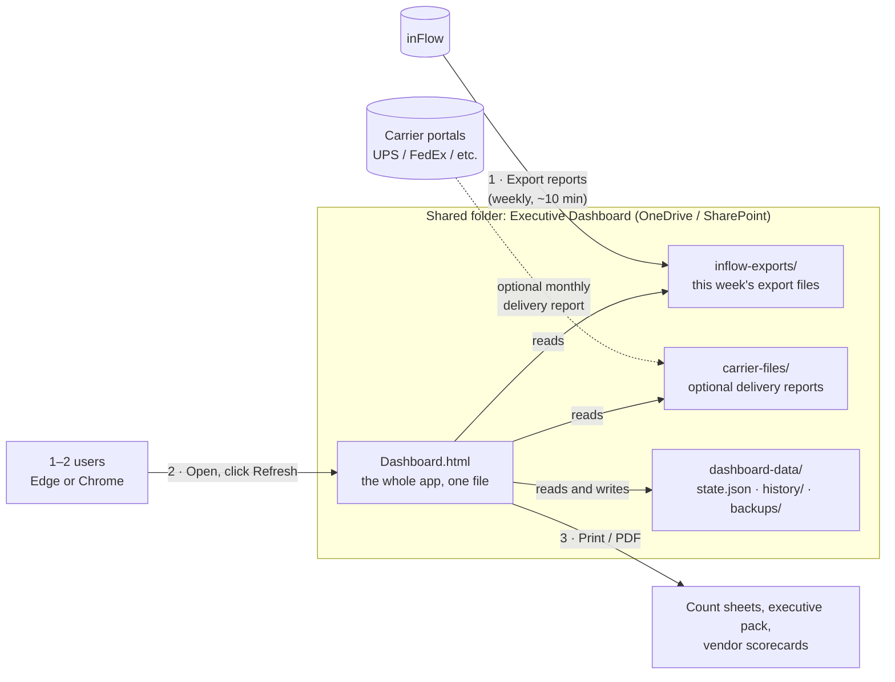
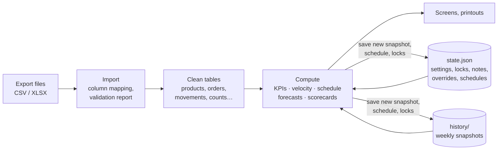
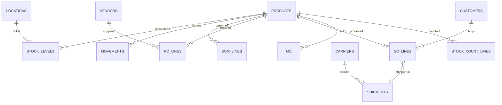
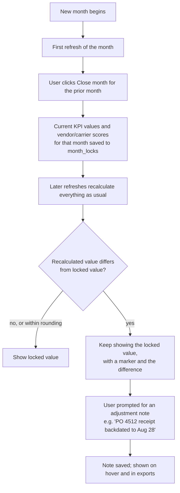
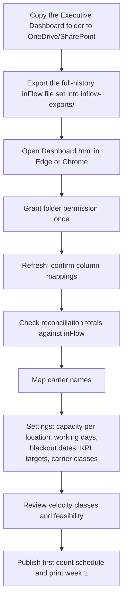
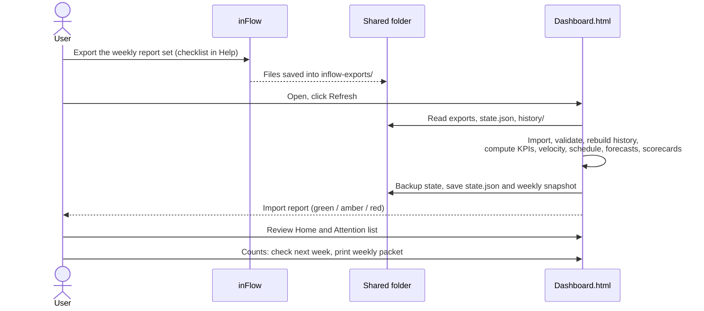
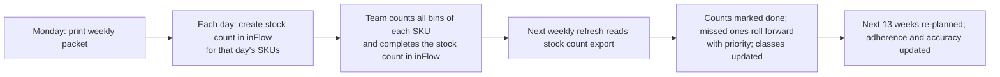
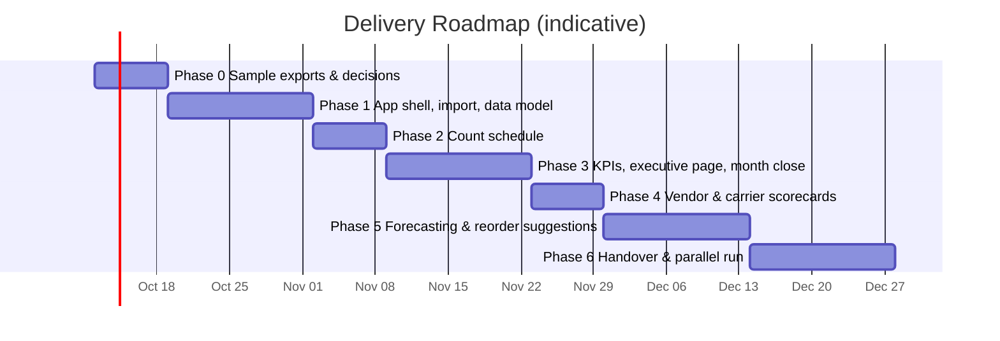

# Executive Operations Dashboard — System Design Document

| | |
|---|---|
| **Status** | Draft v2.3 — stock transfer metrics added, carrier rules and blank-carrier handling confirmed (2 Oct 2026) |
| **Date** | 2026-10-01 |
| **Scope** | KPIs, demand forecasting, cycle count schedules, vendor scorecards, carrier scorecards |
| **Data source** | inFlow Inventory / inFlow Manufacturing **file exports** (CSV/XLSX) |
| **Users** | 1–2 people, full access |
| **Operating model** | No tech team. Built once and handed over. The only routine task is uploading data files. |

---

## Table of Contents

1. [What changed in v2](#1-what-changed-in-v2)
2. [Goals, Non-Goals, and Constraints](#2-goals-non-goals-and-constraints)
3. [Architecture](#3-architecture)
4. [Technology Choices](#4-technology-choices)
5. [Data Inputs: inFlow Exports](#5-data-inputs-inflow-exports)
6. [Data Model](#6-data-model)
7. [Functional Modules](#7-functional-modules)
8. [Screen and Component Hierarchy](#8-screen-and-component-hierarchy)
9. [User Flows](#9-user-flows)
10. [Security and Data Protection](#10-security-and-data-protection)
11. [Designing for Zero Maintenance](#11-designing-for-zero-maintenance)
12. [Implementation Plan](#12-implementation-plan)
13. [Risks and Mitigations](#13-risks-and-mitigations)
14. [What Is Needed From You to Start](#14-what-is-needed-from-you-to-start)
15. [Glossary](#15-glossary)

---

## 1. What changed in v2

v1 assumed a development team to run a cloud platform: servers, a database, job queues, an API integration, single sign-on, and monitoring. That is the wrong shape for a 1–2 person audience with no one to maintain it. v2 is built around the answers to the design review:

| Decision | Answer | Design consequence |
|---|---|---|
| What is one count? | One SKU. All of its bins are counted in the same count. | Count lines and daily capacity are measured in **SKUs per day** at a location. |
| How are counts recorded? | inFlow's Stock Count function | The inFlow stock count export supplies **last-counted dates** and **schedule adherence**. |
| Who uses it? | 1–2 people who see everything | No logins, roles, or row-level permissions. Access is controlled by who can open the shared folder. |
| Is inFlow data reliable? | Yes, all of it | Full history is used. Past stock levels are rebuilt from movement history (§7.2). |
| Edits to closed months? | Lock, with an adjustment note | **Month close** freezes KPI and scorecard values; later differences are shown with a required note (§7.2). |
| Maintenance capacity | None. Uploading data files is the extent of it. | **No servers, no API connection, no accounts.** A single self-contained HTML file reads inFlow exports from a folder. |

**The main trade-off:** The live inFlow API connection is dropped. An API connection needs a server running all the time, a stored API key, and someone to fix it when inFlow changes something. The cost of dropping it is a **10-minute weekly routine**: export a set of files from inFlow, drop them in a folder, and click Refresh. The dashboard is a weekly management tool, and the count schedule is planned weekly, so weekly data matches how it is used.

Removed from v1: cloud hosting (AWS, ECS, RDS, Redis), Terraform, the inFlow API sync and webhooks, the carrier tracking API, single sign-on and roles, the audit log, email alerts and digests, and the separate Python forecasting service. Most v1 review findings about security, scale, and stack weight no longer apply. The data-logic findings are resolved in §7.

---

## 2. Goals, Non-Goals, and Constraints

### 2.1 Goals

- **G1 — One trusted set of numbers.** Every KPI has one written definition shown in the app.
- **G2 — Weekly refresh in about 10 minutes.** Export, drop in a folder, click Refresh.
- **G3 — Drill from number to document.** Any KPI or score opens a list of the orders, receipts, or shipments behind it.
- **G4 — Forward-looking.** Demand forecasts, projected stockouts, and reorder suggestions.
- **G5 — A count schedule the team can follow.** Velocity-based, within daily capacity, printed as daily count sheets.
- **G6 — Runs for years untouched.** No server, no subscriptions, nothing to patch, nothing that expires.

### 2.2 Non-Goals

- Live or real-time data. Data is as fresh as the last upload.
- Writing anything into inFlow. Counts are done and recorded in inFlow, and reorder suggestions are acted on there.
- Automatic emails or alerts. No server exists to send them. The home page has an **Attention** list instead, and any page can be printed or saved as PDF to share.
- Multiple simultaneous editors. Two users can share it, but not edit at the same moment (§6.5).

### 2.3 Constraints

| # | Constraint |
|---|---|
| C1 | Must run on a normal office PC in **Microsoft Edge or Google Chrome** (desktop). No installation, no admin rights. |
| C2 | All files live in a folder the users already have, such as OneDrive, SharePoint, Google Drive for desktop, or a network share. |
| C3 | No external services at runtime. Every library is embedded in the HTML file, so it works offline and can't break when a website changes. |
| C4 | Volumes from the sample exports: ~780 stocked SKUs across 3 locations (Aurora, Houston, DFW); ~30,000 sales order lines and ~6,500 manufacturing order lines a year; US dollars only. The design keeps headroom for 10× this. |

---

## 3. Architecture

### 3.1 How It Fits Together



There is no server. The HTML file is the application. When it's opened, it asks once for permission to use the folder, then reads the export files, computes everything in the browser, and saves its settings and history back into the same folder.

### 3.2 Processing Pipeline (inside the browser)



Every refresh recomputes from the files, so a fix to a formula applies to all history automatically. The only things that must be kept are those that can't be recomputed: settings, notes, overrides, locked month values, published schedules, and weekly snapshots. They live in `dashboard-data/`.

### 3.3 Weekly Routine

| Step | Who | Time |
|---|---|---|
| Export the **8 weekly reports** (§5.4) into `inflow-exports/`, replacing last week's files. A checklist is on the app's Help page. | User | ~10 min |
| Open `Dashboard.html` and click **Refresh** | User | ~1 min |
| Read the import report (green = fine; amber/red explains what's wrong) | User | ~1 min |
| Review the Attention list and next week's count schedule, then print count sheets | User | ~5 min |
| **First week of a month:** click **Close month** for the prior month | User | ~2 min |

---

## 4. Technology Choices

The delivered product is **one HTML file**. The builder uses ordinary development tools, but none of them are needed to run or use the dashboard.

| Concern | Choice | Why |
|---|---|---|
| Delivered format | Single self-contained `Dashboard.html` (all code, styles, and libraries embedded, ~3 MB) | Nothing to install or host. Copy it anywhere. Works offline. |
| Folder access | Browser **File System Access API** (Edge/Chrome), with a drag-and-drop and "download state file" fallback | Lets the app read exports and save state directly in the shared folder after a one-time permission prompt. |
| Language (build time) | TypeScript, bundled to one file (Vite with a single-file plugin) | Type safety for the calculation code. The user never sees it. |
| UI | Preact (small React-compatible library) + plain CSS | Small, stable, and nothing to update. |
| CSV / Excel reading | PapaParse (CSV) and SheetJS (XLSX), embedded | Handles inFlow's CSV and Excel exports, including quoted fields and dates. |
| Charts | Apache ECharts, embedded | Handles forecast bands, calendars, and heatmaps. Prints cleanly. |
| Heavy computation | Web Workers | Forecasting and history rebuilds run off the main thread, so the page stays responsive. |
| PDF output | Browser **Print → Save as PDF** with print-specific layouts | No PDF library to maintain, and it looks the same on paper. |
| Data storage | JSON state file + compressed CSV snapshots in the shared folder | Human-readable, backed up by OneDrive/SharePoint version history, and easy to inspect. |
| Self-test | Built-in **Self-check** button that runs known-answer tests on bundled sample data | If a future browser update ever breaks something, the user can see it immediately. |

**Not used, on purpose:** No external CDN links (a library website going away can't break the app). No browser-only storage for anything important (clearing browser data must not lose anything). No database engine, server, or cloud account.

---

## 5. Data Inputs: inFlow Exports

### 5.1 Sample Files Received (Phase 0, 2 Oct 2026)

| File | What it is | Size | Covers | Verdict |
|---|---|---|---|---|
| `inFlow_SalesOrder` (CSV) | Sales orders, one row per line, with the order header repeated on each line | 19,483 lines / 4,814 orders | Feb 3 – Oct 2, 2026 | Usable |
| `MD_Sales_Orders_Shipped` (CSV, saved custom report) | One row per fulfilled order: order #, customer, order date, fulfillment date | 4,074 orders | Order dates Mar 1 – Sep 30, 2026 | Usable. Provides the ship date missing from the sales export |
| `MD_Complete_MFG_Orders` (CSV, saved custom report) | Completed manufacturing orders: category, product, SKU, MO #, qty, order and completed dates, unit cost | 3,902 rows / 3,406 MOs | Mar 2 – Sep 30, 2026 | Usable |
| `Stock_count_report` (CSV, saved report) | Stock count lines: location, sublocation, SKU, count #, started date, snapshot (on record) qty, counted qty, adjustment and value | 822 lines / 18 counts, all at Aurora | Mar 5 – Sep 29, 2026 | Usable |
| `inFlow_StockLevels` (CSV) | Quantity on hand by SKU, location, and sublocation | 1,208 rows, 780 SKUs, 3 locations | Current | Usable |
| `inFlow_ProductDetails` (CSV) | Product master: SKU, name, category, item type, cost, price, UoM, last vendor, auto-manufacture flag | 1,291 products | Current | Usable |
| `inFlow_BOM` (CSV) | Bills of materials | 1,399 rows (1,196 active), 465 finished products | Current | Usable |
| `Stock_transfer_report` (CSV, saved report) | Transfer lines: transfer #, SKU, transfer / sent / received dates, from and to location and sublocation, qty, cost | 1,227 lines / 381 transfers (20 between sites, 361 bin moves within Aurora) | Jan 23 – Oct 2, 2026 | Usable |
| `Shipment_Summary` (XLSX, from the freight portal) | LTL/truckload shipments: direction, carrier, mode, scheduled vs actual pickup and delivery, weight, total cost | 50 shipments (44 outbound, 6 inbound) | Aug 3 – Oct 1, 2026 | Usable. The second copy sent matches the first |

### 5.2 What the Sample Files Showed

Each finding comes with how the app handles it.

1. **Everything is measured in units.** Units are inFlow's stock unit for each product, so a 1-gallon jug, a 15-gallon kit, and a gallon of bulk blend each count as 1. No gallon conversion is needed.
2. **Manufacturing type is in the MO number.**
   - `FILL-`, `KIT-`, and `BLEND-` prefixes give Units Filled, Kitted, and Blended.
   - `MO-` numbers (1,438 rows, 37%) are **kits built automatically when a sales order is fulfilled**. The product export confirms it: 88 products are flagged `AutoManufacture`. These count as Kitted, and the KPI Explorer splits manual and auto-built kits.
   - 16 rows have typos (`FFILL`, `FIL`, `KIIT`, `KITS`) and are matched to the right type. 9 rows are something else (`BOX`, `BOXED`, `INVENTORYADJUSTMENT`); they go on an "unclassified" list in the import report to be assigned once.
3. **Some quantities include units.** 283 manufacturing rows contain text such as "700 gal." or "328.8.". The importer reads the number and ignores the unit text.
4. **Garbled characters.** "HyperBOND®" in the manufacturing report and "�" in product names. The importer repairs the text encoding.
5. **Ship dates come from the Shipped report.**
   - The sales export's `InvoicedDate` is the same day as the order, so it can't be used as a ship date.
   - The `MD_Sales_Orders_Shipped` report has a fulfillment date per order and matches the sales export on all 4,074 orders.
   - It lists only fully fulfilled orders, so a partly shipped order counts when it's complete.
   - 5 orders have no fulfillment date and are skipped.
6. **Non-item sales lines.** "Tax from imported order" lines (1,906) are excluded from sales. "Adjustment from imported order" lines (1,154) aren't items, so they're excluded from units, but **count in Total Sales**.
7. **Carrier is blank on most orders.**
   - `ShippingCarrier` is empty on 2,761 of 4,814 orders (57%). Those orders carry $308,002 (68%) of all freight charged to customers.
   - **Confirmed handling:** blank carrier is "Carrier unknown". These orders are **included** in Fulfillment Speed and in Freight Paid, and shown as their own group in breakdowns.
8. **Ground vs freight carriers (confirmed).**
   - Ground shipments are left out of all transportation metrics, and every transportation KPI's on-screen description says so.
   - Carrier table:
     - **Ground:** every UPS value ("UPS", "UPS Ground"), FedEx Ground, FedEx Home, FedEx 2-day, FedEx Priority Overnight.
     - **Freight:** plain "FedEx", FedEx Freight, XPO, Dayton Freight, TForce, Saia, SEFL, OD, Fort Freight.
     - **Not shipped:** Pickup, Local Delivery.
     - **Carrier unknown:** blank.
   - New carrier values appear on the import report to classify once.
9. **Freight portal data.**
   - The Shipment Summary holds the freight **spent** on LTL and truckload shipments.
   - **No sales order is ever treated as a transfer.** Transfers come only from the stock transfer report. A freight-portal shipment counts as **transfer freight** only when it matches a transfer in that report: same origin and destination site, pickup within 3 days of the transfer's sent date. The sample matched 6 of the 9 portal shipments between your cities. The other 3 stay in outbound freight and are listed on the import report as "between your sites, no transfer found".
   - Only 18 of 50 shipments match a sales order by tracking number, and 5 by order number. Weekly totals don't need the match; drill-down lists unmatched shipments as "Not linked to an order".
   - 33 of 50 shipments have no actual arrival time, so carrier on-time delivery covers only some shipments.
10. **Stock count report.**
    - Counts exist only for Aurora so far. Houston and DFW will start later. Each location has a "counting active" switch, and accuracy is reported per location from its first count.
    - The report has a started date but no completed date or status, so a count is dated by its started date.
    - 26 lines have a blank counted quantity; they're treated as not counted.
    - 176 lines have a negative quantity on record. Under your formula these shrink the denominator (see §7.1).
11. **Stock transfer report.**
    - Of 381 transfers, 20 move stock **between sites**: Aurora→DFW 8, DFW→Houston 10, Houston→DFW 2. The other 361 are **bin moves within Aurora** (same from and to location). The two are reported separately.
    - All transfers in the sample have a received date, so "in transit" can only be measured if the report also lists unreceived transfers (to confirm).
    - 193 lines have $0 cost, so transferred value is understated for those items.
    - Aurora→DFW transfers ($440K) have no matching freight-portal shipment, so their freight cost isn't in the portal file.
12. **Product and stock data quality.**
    - 57 product rows have no SKU, and 41 stock rows don't match a product by SKU or name. These are listed on the import report.
    - 217 stock rows with positive on-hand have a **$0 or blank cost**, so Current Inventory Value is understated until costs are filled in inFlow.
    - 156 stock rows are negative. They're excluded from inventory value and shown on the Attention list.
13. **Location gaps.** 29% of sales lines have no location, and the manufacturing report has no location column. Location breakdowns show an "Unassigned" group.
14. **History depth.** The files cover 7–8 months. That's enough for weekly KPIs, but forecasting and year-over-year comparison need more. If older data exists in inFlow, a one-time full export is needed.

### 5.3 File Set: Status

| # | File (role) | Used for | Status |
|---|---|---|---|
| F1 | Product Details | Costs, categories, new SKUs, auto-built kits | Received |
| F2 | Stock Levels | Inventory value, count sheets, weekly snapshot | Received |
| F3 | Inventory movement history | Velocity including receipts and transfers, rebuilding past stock levels | Optional. Without it, velocity uses sales lines, manufacturing output, and BOM-based component use, and stock history starts from the first weekly snapshot |
| F4 | Sales Orders | Units Sold, Total Sales, Freight Paid, carrier | Received |
| F4b | Sales Orders Shipped | Fulfillment Speed, Units Shipped | Received |
| F5 | Purchase orders with receipts | Vendor scorecards | Later phase |
| F6 | Completed MFG Orders | Units Blended / Filled / Kitted, velocity | Received |
| F7 | BOM | Component use for velocity and forecasting | Received |
| F8 | Stock Count report | Inventory Accuracy %, last-counted dates | Received |
| F9 | Vendors | Vendor scorecards | Later phase |
| F10 | Stock transfer report | Transfer metrics, transfer freight matching, velocity (transfers out) | Received |
| C1 | Freight portal Shipment Summary | Freight spent (outbound, inbound, transfers), carrier on-time | Received |
| ~~C2~~ | ~~Parcel freight cost~~ | Not needed: ground shipments are excluded from transportation metrics | Dropped |

### 5.4 Weekly Upload Checklist

Every Monday (or the first workday of the week), export these into `inflow-exports/`, replacing last week's files. **File names don't matter**: the app recognizes each report by its columns.

| # | Report | Where | Date filter | Feeds |
|---|---|---|---|---|
| 1 | **Sales Orders** (`inFlow_SalesOrder`) | inFlow → Sales Orders → Export | Order date: last 90 days | Units Sold, Total Sales, Freight Paid, velocity |
| 2 | **MD Sales Orders Shipped** (saved report) | inFlow → Reports | Fulfillment date: last 90 days | Order Fulfillment Speed, Units Shipped |
| 3 | **MD Complete MFG Orders** (saved report) | inFlow → Reports | Completed date: last 90 days | Units Blended / Filled / Kitted, velocity |
| 4 | **Stock count report** (saved report) | inFlow → Reports | Started date: last 90 days | Inventory Accuracy %, last-counted dates for the count schedule |
| 5 | **Stock Levels** (`inFlow_StockLevels`) | inFlow → export | None (current) | Current Inventory Value, count sheets, weekly history snapshot |
| 6 | **Product Details** (`inFlow_ProductDetails`) | inFlow → Products → Export | None (current) | Costs for inventory value, categories, new SKUs |
| 7 | **Shipment Summary** | Freight portal | Scheduled pickup: last 90 days | Freight spent: outbound, inbound, transfers; carrier on-time |
| 8 | **Stock transfer report** (saved report) | inFlow → Reports | Transfer date: last 90 days | Transfer metrics, transfer freight, velocity |

**Monthly, or whenever BOMs change:** 9. **BOM** (`inFlow_BOM`), for component use in velocity.

**First upload only:** reports 1–4, 7, and 8 with **all available history**, not just 90 days.

**Why 90 days every week:** Each upload overlaps the previous ones. The app merges by key (order # + line, MO #, count # + SKU, transfer # + SKU, shipment ID), keeping the newest version of each row and its own archive of everything older (§6.3). Late edits and backdated changes within 90 days are picked up automatically, and a missed week loses nothing. The import report flags any report whose newest date is more than 8 days old.

### 5.5 Import and Column Mapping

- **Saved column mappings.** The app recognizes each report's column headings automatically. Anything it can't match is shown on a mapping screen ("Which column is Fulfillment Date?"). Mappings are saved, so if inFlow renames a column later, the user fixes it from a dropdown. No code change is needed.
- **Validation report after every refresh:**
  - **Green:** row counts, date range, and totals per file.
  - **Amber:** data issues that limit a metric, such as unclassified manufacturing orders, unclassified carriers, blank carriers, items with $0 cost, shipments not linked to an order, or negative stock.
  - **Red:** a missing report or column, or a report older than the others. Calculations that depend on it are paused and the screen says why.
- **Reconciliation figures** on the import page, such as on-hand quantity by location and weekly sales, can be checked against the same totals in inFlow.

---

## 6. Data Model

There is no database server. The data model has three layers: **imported tables** (rebuilt from files on every refresh), **derived tables** (computed on every refresh), and **persisted state** (saved to the folder, the only data that must be kept).

### 6.1 Imported Tables (in memory, rebuilt each refresh)



| Table | Key | Main fields | Source |
|---|---|---|---|
| `products` | sku | name, category, item_type, uom, cost, price, preferred_vendor, is_active, reorder_point_inflow | F1 |
| `locations` | location | name, timezone (from settings) | F2 |
| `stock_levels` | sku + location + bin | on_hand, reserved, on_order, unit_cost | F2 |
| `movements` | row id | date, sku, location, bin, qty (signed), type (`sale, receipt, mo_consume, mo_produce, transfer_in, transfer_out, adjustment, count_adjustment, return`), doc_number | F3 |
| `so_lines` | order # + line | customer, location, order_date, requested_ship, promised_ship, status, sku, qty, price, cost_at_sale, shipped_qty, ship_date, carrier_raw, tracking, freight | F4 |
| `po_lines` | PO # + line | vendor, location, order_date, promised_date, status, sku, qty_ordered, unit_cost, currency, qty_received, first_receipt_date, last_receipt_date | F5 |
| `mo` | MO # | sku, location, qty_planned, qty_completed, start, due, completed_date, status | F6 |
| `mo_components` | MO # + sku | qty_required, qty_consumed | F6 |
| `bom_lines` | parent + component | qty_per | F7 |
| `stock_count_lines` | count # + sku + bin | location, completed_date, status, counted_qty, system_qty | F8 |
| `vendors` | vendor | code, default_lead_time_days, currency | F9 |
| `shipments` | tracking # (or order # + ship date) | carrier (mapped), service, ship_date, delivered_date, freight | F4 + C1 |

### 6.2 Derived Tables (computed each refresh)

| Table | Grain | Main fields |
|---|---|---|
| `inventory_history` | week × sku × location | on_hand, value. Rebuilt backwards from current on-hand using movements (§7.2) |
| `kpi_values` | KPI × period (week/month) × dimension (company/location/category/vendor/carrier) | value, numerator, denominator, sample_size, locked_value, adjustment_note_id |
| `velocity` | sku × location | transactions_90d, units_90d, rank, cumulative_pct, computed_class, final_class (after overrides and the stability rule) |
| `count_plan` | sku × location × date | due_date, scheduled_date, class, walk_order (first bin path), status (`scheduled, done, late, missed, at_risk`) |
| `abc_class` | sku | annual usage value, A/B/C (used for forecasting service levels) |
| `forecast` | sku × location × week (26 weeks ahead) | p10, p50, p90, model, demand_class, backtest_error, low_confidence |
| `replenishment` | sku × location | avg weekly demand, lead time (mean and variation), safety stock, reorder point, suggested qty, projected stockout date, days of cover |
| `vendor_scores` | vendor × month | metric values, normalized scores, overall score, grade, rank, sample size |
| `carrier_scores` | carrier × month | metric values, normalized scores, overall score, grade |

### 6.3 Persisted State (`dashboard-data/`)

This is the only data that must survive between sessions. All of it is plain files in the shared folder.

**`dashboard-data/state.json`**

| Section | Contents |
|---|---|
| `meta` | file format version, last refresh time, last saved by (user's name, typed once), revision number |
| `settings.company` | fiscal calendar (calendar months or 4-4-5), fiscal year start, week definition (Monday–Sunday), timezone per location. Currency is US dollars only; the import report flags any other currency code. |
| `mo_type_rules` | MO-number prefix → type (`blend, fill, kit, kit_auto, other`), typo variants, plus per-product assignments for unclassified orders |
| `carrier_classes` | inFlow carrier value → `ground`, `freight`, `not_shipped`, or `unknown` |
| `own_locations` | your sites and their freight-portal city names (Aurora = Aurora, IL; DFW = Carrollton, TX; Houston = Cypress, TX), used to match portal shipments to transfers; `counting_active` flag per site |
| `settings.calendar` | business days (Mon–Fri) and holidays, used for fulfillment speed |
| `settings.counts` | velocity window (90 days), metric (`transactions`), class cutoffs (80% / 95%), cadence per class (fast 1 wk, medium 2 wk, slow 4 wk, dormant 52 wk), placement window per class, demotion rule (2 runs), working days (**Tuesday–Friday**), **daily capacity (default 50 SKUs/day, range 40–60)** per location, blackout dates |
| `settings.kpis` | which KPIs are on the executive page, targets and warning thresholds per KPI |
| `settings.forecast` | service level per ABC class, horizon, default lead time |
| `settings.scorecards` | vendor and carrier metrics, weights (sum = 100), targets, floors, grace days, minimum sample size, grade scale |
| `column_mappings` | per file role: inFlow column heading → field |
| `carrier_aliases` | free-text carrier/shipping-method values → carrier and service level |
| `velocity_overrides` | sku, location, forced class, reason, expiry |
| `velocity_history` | last 4 weekly class assignments per sku × location (drives the demotion rule) |
| `count_schedule` | published weeks: per sku × location, scheduled date and locked flag. Weeks already printed are fixed. |
| `month_locks` | per closed month: locked KPI values and vendor/carrier scores, closed date, closed by |
| `adjustment_notes` | month, KPI or scorecard, locked value, current recalculated value, difference, note text, author, date |
| `forecast_overrides` | sku, location, week range, absolute or %, reason, expiry |
| `forecast_snapshots` | lag-1 and lag-4 week forecast per sku × location for the last 13 weeks, plus weekly accuracy summaries by ABC class (kept indefinitely) |
| `quality_events` | vendor, PO #, sku, type (defect, damage, wrong item, paperwork), qty affected, cost, date, note |
| `carrier_claims` | carrier, tracking/order #, type (damage, loss, delay), amount claimed/recovered, dates |
| `recommendation_status` | sku × location: reviewed / dismissed (with reason), date |

**`dashboard-data/archive/`** — The merged history of every weekly report: sales lines, shipped orders, manufacturing orders, stock count lines, and freight shipments. Stored as compressed CSV per report and updated by key on every refresh, so weekly uploads only need the last 90 days.

**`dashboard-data/history/`** — One compressed CSV per weekly refresh with on-hand by SKU × location. This is a check on the rebuilt history and a fallback if movement history is ever incomplete.

**`dashboard-data/backups/`** — Before every save, the previous `state.json` is copied to `backups/state-YYYY-MM-DD-HHMM.json`. The last 26 are kept. OneDrive/SharePoint version history is a second layer.

### 6.4 Data Volumes

At the assumed volumes (C4), five years of order lines and movements is about 1–2 million rows. To stay fast in a browser, imported tables are held **column by column** (typed arrays, with repeated text values stored once), not as millions of separate objects. Expected memory is under 500 MB, and a full refresh takes under a minute on a typical office PC. If history grows beyond this, the app keeps a configurable window (default 5 years) for detail and keeps monthly summaries for older periods.

### 6.5 Two Users, One State File

- Each user opens the same `Dashboard.html` from the shared folder.
- On save, the app re-reads `state.json`. If the revision number changed since it was loaded (the other person saved in between), it merges non-conflicting changes, such as notes and settings in different sections. If both people changed the same item, it asks which to keep. Nothing is silently overwritten.
- The top bar shows "Last refreshed by Pat, Mon 7:42 AM", so both users know which data they're looking at.

---

## 7. Functional Modules

### 7.1 KPIs

**Executive page.** These tiles show the **previous week (Monday–Sunday)** unless noted. Each tile shows the value, the change from the week before, the 13-week average, and a sparkline. Report numbers refer to the weekly checklist (§5.4).

| KPI | Definition (as shown in the app) | Reports | Status |
|---|---|---|---|
| Inventory Accuracy % | (Σ counted quantity ÷ Σ quantity on record) × 100, over all stock count lines started last week. Lines with no counted quantity are skipped. | 4 | Ready |
| Units Blended | Σ quantity on Blend orders completed last week | 3 | Ready |
| Units Filled | Σ quantity on Fill orders completed last week | 3 | Ready |
| Units Kitted | Σ quantity on Kit orders completed last week, including kits auto-built at sales order fulfillment (`MO-` numbers) | 3 | Ready |
| Order Fulfillment Speed | Average business days from order date to fulfillment date, for orders fulfilled last week. **Pickup orders are excluded.** Also shows the median and % fulfilled within 1 business day. | 1 + 2 | Ready |
| Units Sold | Σ quantity on item lines of sales orders placed last week. Quotes excluded; tax and adjustment lines aren't items. | 1 | Ready |
| Units Shipped | Σ quantity on item lines of orders fulfilled last week | 1 + 2 | Ready |
| Freight Paid vs Freight Spent | **Paid:** freight charged to customers on orders fulfilled last week by freight carriers or with carrier unknown. **Spent:** total cost of outbound customer shipments picked up last week in the freight portal. Shows both dollar amounts and recovery % (paid ÷ spent). *Ground shipments, inbound freight, and transfer freight are not included. Orders with no carrier are included as "Carrier unknown".* | 1 + 2 + 7 | Ready |
| Freight as % of Sales | Outbound customer freight spent ÷ Total Sales, last week. *Ground shipments are not included.* | 1 + 7 | Ready |
| Total Freight Spend | All freight-portal cost picked up last week: outbound to customers + inbound + transfer freight (portal shipments matched to a stock transfer), with each part shown. *Ground shipments are not included.* | 7 + 8 | Ready |
| Stock Transfers | Inter-site transfers **sent** last week: number of transfers, units, and value at cost. Bin moves within a site are not included. | 8 | Ready |
| Transfer Transit Time | Average business days from sent to received for inter-site transfers received last week | 8 | Ready |
| Current Inventory Value | Σ on-hand quantity × product cost, as of the latest Stock Levels upload. Negative on-hand excluded. | 5 + 6 | Ready ($0-cost caveat, §5.2) |

**Supporting metrics** (in the KPI Explorer, and available as tiles):

| Metric | Definition |
|---|---|
| Total Sales | Σ item line subtotals **+ adjustment lines**, tax excluded, by order date. This is the denominator for Freight as % of Sales. |
| Inbound Freight Spend | Freight-portal cost of inbound shipments. Standalone metric, also part of Total Freight Spend. |
| Transfer Freight Spend | Freight-portal cost of shipments matched to a stock transfer. Also shown as freight cost per $100 of value transferred. |
| Transfer Processing Time | Average days from transfer date (created) to sent date |
| Transfers In Transit | Inter-site transfers sent but not yet received: count and value. Needs the report to include unreceived transfers. |
| Internal Bin Moves | Transfers where from and to location are the same: moves, lines, and units by location |
| Count lines exact % | Share of counted lines where counted = on record. Shown next to Inventory Accuracy %, because the accuracy formula nets overcounts against undercounts. |

**Draft values from the sample files, week of Sep 21–27, 2026** (to check against what you know; not final):

| KPI | Draft value |
|---|---|
| Inventory Accuracy % | 90.9% by the formula, vs **98% in your numbers**. Reconciliation is in §7.1b and an open question in §14. |
| Units Blended / Filled / Kitted | 7,676 / 4,495 / 1,385 (992 manual + 393 auto-built) |
| Units Sold | 13,988 |
| Total Sales | $509,442 ($500,694 items + $8,748 adjustments; $19,357 tax excluded) |
| Order Fulfillment Speed | 1.6 business days on average (median 1), 156 non-pickup orders, 90% within 1 business day |
| Freight spent (portal) | $6,099 outbound (8 shipments), $1,338 inbound |
| Stock Transfers | 2 inter-site transfers sent, 815 units, $69,256 at cost; average 1.5 days in transit |
| Current Inventory Value | $3.13M (Aurora $2.59M, DFW $366K, Houston $175K), understated by $0-cost items |

More KPIs can be added later as definitions in the same format. Candidates the data supports: inventory turns, stockout rate, count schedule completion, gross margin, backlog, and production by product family.

**Calculation rules**

- **Roll-ups** use numerator and denominator, never an average of averages. For example, accuracy over a month is total counted ÷ total on record for the month, not the average of weekly percentages.
- **Weeks** run Monday–Sunday. Business days are Monday–Friday minus the holidays in Settings.
- **Units** are inFlow's stock unit for each product. No unit conversion is applied.
- **Currency:** US dollars only. Any other currency code is flagged.
- **Excluded from units:** quotes, cancelled orders, tax lines, adjustment lines. **Excluded from Total Sales:** quotes, cancelled orders, tax lines.
- **Transportation metrics** exclude ground shipments (all UPS, FedEx Ground/Home/2-day/Overnight), and their on-screen descriptions say so.
- **Inventory Accuracy note:** As defined, overcounts offset undercounts, and negative on-record quantities shrink the denominator. "Count lines exact %" is shown alongside so the headline number can't hide large offsetting errors.

### 7.1b Inventory Accuracy Reconciliation (open)

Your figure for last week is **98%**. The same formula on the sample stock count report gives these results:

| Count lines included | Σ counted ÷ Σ on record |
|---|---|
| Started Sep 21–27 (5 counts, 132 lines), all lines | 90.9% |
| Sep 21–27, excluding lines with negative on-record | 85.7% |
| Started Sep 28 – Oct 2 ("Cycle Count 9/29", 87 lines), all lines | 107.2% |
| Sep 28 – Oct 2, excluding negative on-record | **98.6%** |
| Last 7 days to Oct 2, excluding negative on-record | 99.1% |

The Sep 21–27 result is pulled down mostly by two pigment items in "Cycle Count 9.21" (873 on record vs 423 counted, and 931 vs 534). The closest match to 98% is the most recent count with negative on-record lines left out. The KPI will be set to match the method you use (§14).


### 7.1a KPI Explorer (expanded KPI page)

Clicking any tile, or opening **KPIs** in the menu, opens the KPI Explorer, which shows each KPI over time in depth.

- **Time range:** last 13, 26, or 52 weeks, year to date, or custom. View by week or by month.
- **Trend chart:** the KPI over time, with a target line, a 4-week moving average, and markers on closed months (§7.2).
- **Comparisons:** previous period, and the same week last year once a year of history exists.
- **Breakdowns,** where they make sense:
  - **Production units:** by type (blended, filled, kitted manual, kitted auto-built), product category, and product.
  - **Units sold, units shipped, and sales:** by product category, product, customer, and location.
  - **Fulfillment speed:** by location, carrier class, and days-to-fulfill buckets (0, 1, 2, 3–5, 6+).
  - **Freight:** by direction (outbound, inbound, transfer), carrier, mode (LTL, truckload), and origin location.
  - **Transfers:** by lane (from → to), product category, and product. Transit and processing time trends. Bin moves by location.
  - **Inventory accuracy:** by location, count, velocity class, and SKU, with the biggest variances first.
  - **Inventory value:** by location and category.
- **Production vs demand view:** units blended, filled, and kitted as stacked bars, with units sold and shipped as lines on the same chart.
- **Compare view:** up to three KPIs on one chart (for example, units shipped vs freight % of sales).
- **Weekly table** under the chart, exportable to CSV, with drill-down from any week to the orders, manufacturing orders, count lines, or shipments behind it.

### 7.2 Inventory History and Month Close

**Past stock levels.** inFlow exports only current stock, so the weekly Stock Levels upload is saved as a snapshot each week, and stock history builds up from the first upload. If the optional movement history export (F3) is added later, the app can also rebuild earlier weeks by walking backwards from current on-hand, and the snapshots check that rebuild (flagging differences over 0.5%).

**Month close and adjustment notes:**



- Locked months always display the locked value. Reports and comparisons (month over month, year over year) use locked values.
- The difference and its note appear next to the value. A summary of all adjustments is on the Month Close page.
- Drill-down for a locked month shows the current underlying documents, and marks the ones that changed after the lock.
- Open months and weeks are always recalculated.

### 7.3 Cycle Count Schedule

The dashboard plans counts. Counting and recording happen in inFlow's Stock Count function. **One count = one SKU at one location, covering all of its bins.**

**Velocity classification** (every refresh)

1. For each SKU × location, count **transactions** over the last 90 days: sales order lines, manufacturing order lines, component use worked out from the BOM, and stock transfer lines in or out (inter-site and bin moves). Receipts aren't included unless the optional movement history export (F3) is added.
2. Rank SKUs from most to least transactions and classify them by cumulative share:

   | Class | Default rule | Cadence | Placement window |
   |---|---|---|---|
   | Fast | SKUs making up the top 80% of transactions | **Weekly** | ±2 working days, stays in its week |
   | Medium | The next 15% | **Every 2 weeks** | ±3 working days |
   | Slow | Remaining SKUs with any movement | **Monthly** (every 4 weeks) | ±5 working days |
   | Dormant | No movement in 90 days, but stock on hand | Yearly | ±10 working days |

   SKUs with no movement and no stock are left off.
3. **Overrides:** Pin any SKU to a class, with a reason and optional expiry.
4. **Stability:** Promotions take effect immediately. Demotions only happen after two weekly refreshes in a row agree.

**Last-counted date.** The most recent **completed** inFlow stock count (F8) that recorded a counted quantity for that SKU at that location. Stock counts that are open, voided, or have a blank counted quantity don't count. A SKU that appears on a count sheet but was skipped stays due.

**Building the schedule** (every refresh, for the next 13 weeks)

1. **Feasibility check.** Required SKUs per day = Σ over classes of (SKUs in class ÷ working days in its cadence). Counting runs **Tuesday–Friday (4 days a week)** with **40–60 SKUs a day**.

   **Estimate from the sample files (Aurora):** about 122 fast, 135 medium, 221 slow, and 256 dormant SKUs. That needs **~62 SKUs a day**: 30.5 fast + 16.9 medium + 13.8 slow + 1.2 dormant. This is just above the top of your range. Options from the same data:

   | Setting | SKUs/day at Aurora |
   |---|---|
   | Weekly / every 2 weeks / monthly, Fast = top 80% | ~62 |
   | Same cadences, Fast = top 70% | ~58 |
   | Fast = top 80%, Slow every 8 weeks | ~56 |
   | Fast = top 70%, Slow every 8 weeks | ~51 |

   Capacity is **40–60 SKUs a day per location** (confirmed). Houston and DFW need roughly 16–23 SKUs a day each, well within capacity; these figures are rough because 29% of sales lines have no location. At Aurora, the default recommendation is Fast = top 70% (~58 a day). If the required load exceeds capacity, the screen shows the gap and the levers: raise capacity, tighten the Fast cutoff, or lengthen a cadence. A schedule that can't keep its cadences can still be used, but the shortfall stays visible.
2. **Due date** = last-counted date + cadence. Never counted = due now.
3. **Placement:** Each count goes on the working day nearest its due date. When a day is full, it moves to the nearest day with room inside its placement window. Fast SKUs are placed first. SKUs in the same zone or aisle are grouped onto the same day when every count stays in its window. Counts that can't fit in their window are marked **at risk**, not quietly pushed later.
4. **Locking:** The current week and any week already printed are fixed. Later weeks are re-planned each refresh to account for completed counts, class changes, and new SKUs.
5. **Walk order:** Each day's list is sorted by the SKU's first bin path. All of the SKU's bins are listed on its line.

**Outputs**

- **Calendar:** counts per day against capacity, colored by class, with at-risk days highlighted.
- **Daily count sheet** (print or PDF): SKU, description, UoM, all bins, and a blank count column. System quantity is hidden by default (blind count). Header note: count fast movers before picking starts.
- **Weekly packet:** five daily sheets printed in one go.
- **CSV of the day's SKUs**, for creating the stock count in inFlow (if inFlow's stock count supports importing an item list; to confirm in Phase 0).
- **Adherence view:** done on time, done late, or missed, by class and by week. It also shows count accuracy from the counted versus system quantities in F8.

### 7.4 Forecasting and Replenishment

Runs in the browser (in a background worker) at every refresh. About 10,000 series take roughly 1–3 minutes.

1. **Demand history:** Weekly shipped quantity by requested-ship week, plus component demand from manufacturing orders and BOMs, minus returns. Weeks where the rebuilt history shows zero stock are marked as stockouts and excluded from model fitting, so lost sales don't drag the forecast down.
2. **Demand class:** smooth, erratic, intermittent, lumpy, new (< 13 weeks), or inactive.
3. **Models**, all well-established and deterministic:
   - Smooth or erratic demand: seasonal naive, simple exponential smoothing, Holt, and Holt-Winters (when there are ≥ 2 years of history).
   - Intermittent or lumpy demand: Croston (SBA) and TSB.
   - New SKUs: the category's average pattern, scaled. Flagged low-confidence.
4. **Model choice:** Backtest on the last 8 weeks for each SKU and pick the lowest weighted error, with a guard against bias. Ranges (p10/p90) come from backtest errors.
5. **Overrides** from state (for example "+30% weeks 12–15, promotion") are applied after the statistical forecast.
6. **Replenishment:**
   - ABC class (by annual usage value) sets the service level, for example A 98%, B 95%, C 90%.
   - Safety stock = z × √(lead time × demand variance + demand² × lead-time variance).
   - Lead time mean and variation come from actual PO receipts per vendor and SKU, falling back to the vendor default.
   - Reorder point = demand during lead time + safety stock. Suggested quantity rounds up to MOQ and pack size.
   - Projected stockout date = on hand + on order − forecast, week by week.
7. **Accuracy:** Each refresh saves lag-1 and lag-4 forecasts, and compares older ones to actual demand. This feeds the Forecast Accuracy KPI.

Reorder suggestions are a list to act on in inFlow, with a CSV export. Nothing is written to inFlow.

### 7.5 Vendor Scorecards (monthly)

| Metric | Calculation | Weight |
|---|---|---|
| On-Time Delivery | PO lines fully received by promised date + grace days ÷ lines due | 30 |
| In-Full | Lines where received qty ≥ 98% of ordered ÷ lines closed | 20 |
| Lead-Time Reliability | Based on variation of actual vs. expected lead time | 15 |
| Price Variance | Σ (PO cost − standard cost) × qty ÷ spend | 15 |
| Quality | 1 − (qty in quality events ÷ qty received) | 20 |

Rules for the v1 review edge cases:

- **On time means fully received on time.** The date that counts is when the line reached 98% received, not the first partial receipt.
- **Missing promised date:** The app uses the PO due date if there is one, otherwise order date + vendor default lead time. The scorecard shows how many lines used a fallback.
- **Small samples:** Vendors with fewer than 5 PO lines due in the month show "Insufficient data" instead of a score.
- Quality events are entered in the dashboard, since inFlow doesn't capture them.

Output: leaderboard, detail page with the PO lines behind each metric, and a print/PDF scorecard to send to the vendor. Closed months use locked scores (§7.2).

### 7.6 Carrier Scorecards (monthly)

inFlow records which carrier shipped an order and the tracking number, but not when it was delivered. Two levels are supported:

| Level | Data | Metrics available |
|---|---|---|
| **Basic** (inFlow only) | F4 shipping fields | Shipment volume, freight cost per shipment and per order, ship-on-time (left by promised ship date), tracking compliance (% with a tracking #), claims rate (from claims entered in the app) |
| **Full** (+ carrier files) | Monthly delivery report downloaded from each carrier's website (UPS, FedEx, etc. all offer shipment history exports) and dropped into `carrier-files/` | Adds on-time delivery and transit-time reliability, matched to inFlow orders by tracking number |

Carrier names in inFlow are often free text ("UPS Ground", "ups", "UPS-GND"). A one-time mapping screen groups them, and new variants appear on the import report.

---

## 8. Screen and Component Hierarchy

```
Dashboard.html
├── <AppShell>
│   ├── <TopBar>
│   │   ├── <FolderStatus>            connected folder, data as of, last refreshed by
│   │   ├── <RefreshButton>           runs import → compute → save, with progress
│   │   ├── <PeriodPicker>            week / month / quarter / YTD, compare to prior or last year
│   │   └── <LocationFilter>
│   ├── <SideNav>                     Home · KPIs · Counts · Forecast · Vendors · Carriers · Month Close · Data · Settings · Help
│   └── <Page>
│
├── Home (executive page)
│   ├── <KpiTileGrid>                 previous-week value, change vs prior week, 13-week avg, sparkline, lock marker
│   │   └── click → KPI Explorer for that KPI
│   ├── <AttentionList>               stockout risks, past-due POs, MOs behind, at-risk counts, import warnings
│   ├── <ScorecardSnapshot>           top/bottom vendors and carriers
│   └── <PrintExecutivePack>
│
├── KPIs (KPI Explorer)
│   ├── <KpiList>                     all KPIs, grouped: Inventory · Production · Sales · Freight
│   ├── <RangeAndGrain>               13 / 26 / 52 weeks, YTD, custom; week or month
│   ├── <KpiTrendChart>               target line, 4-week moving average, prior-period / last-year overlay
│   ├── <BreakdownTabs>               by type / product family / product / customer / location / carrier / mode
│   ├── <ProductionVsDemandChart>     blended + filled + kitted units (stacked) vs units sold / shipped
│   ├── <CompareKpis>                 up to 3 KPIs on one chart
│   ├── <WeeklyTable>                 values by week, CSV export, drill to orders
│   └── <KpiDefinition>               plain-English formula and data source
│
├── Counts
│   ├── <FeasibilityBanner>           required vs available SKUs/day, levers if short
│   ├── <CountCalendar>               month/week, load vs capacity, at-risk days
│   │   └── <DayList>                 walk-ordered SKUs with all bins
│   ├── <PrintSheets>                 daily sheet / weekly packet / CSV for inFlow
│   ├── <VelocityTable>               transactions, rank, class, previous class, override
│   │   └── <OverrideDialog>
│   └── <AdherenceAndAccuracy>        on time / late / missed by class; count accuracy trend
│
├── Forecast
│   ├── <StockoutRiskTable>           projected stockout date, days of cover
│   ├── <ReorderSuggestions>          suggested qty, vendor, status, CSV export
│   ├── <AccuracySummary>             by ABC class and lag
│   └── <ItemDetail>
│       ├── <ForecastChart>           history, p10–p90 band, overrides, stockout weeks
│       ├── <ProjectionChart>         on hand + on order − forecast
│       ├── <ModelCard>
│       └── <OverrideEditor>
│
├── Vendors / Carriers  (same structure)
│   ├── <MonthPicker>
│   ├── <Leaderboard>                 rank, grade, score, trend, sample size
│   └── <ScorecardDetail>
│       ├── <MetricBreakdown>         raw value, score, weight, target
│       ├── <EvidenceTable>           PO lines / shipments behind each metric
│       ├── <QualityEventLog> + form  (carriers: <ClaimsLog> + form)
│       └── <PrintScorecard>
│
├── Month Close
│   ├── <CloseMonthButton>
│   ├── <LockedMonthsList>
│   └── <AdjustmentsTable>            locked vs current, difference, note (required)
│
├── Data
│   ├── <ImportReport>                per file: rows, date range, totals, warnings
│   ├── <ReconciliationTotals>        compare with inFlow
│   ├── <ColumnMappingEditor>
│   ├── <CarrierClassEditor>          ground / freight / not shipped / unknown; unclassified values highlighted
│   ├── <OwnLocationsEditor>          site names used to spot transfer shipments
│   ├── <MoTypeRulesEditor>           prefixes, typo variants, unclassified orders
│   └── <CarrierMappingEditor>
│
├── Settings                          company, counts, KPI targets, forecast, scorecard weights, MO type rules, carrier classes, holidays
│
└── Help
    ├── <WeeklyChecklist>             which inFlow exports, where to save them
    ├── <Troubleshooting>             what each red/amber message means and what to do
    ├── <SelfCheck>                   runs built-in tests on sample data
    └── <BackupRestore>               restore state from a backup
```

---

## 9. User Flows

### 9.1 First-Time Setup (once, with the builder)



### 9.2 Weekly Refresh



### 9.3 Count Schedule Week



### 9.4 Month Close

1. In the first week of the new month, after the weekly refresh, open **Month Close**.
2. Review the prior month's KPIs and scorecards, then click **Close month**. Values are locked.
3. In later weeks, if a backdated change alters a locked month, the Month Close page lists it and asks for an adjustment note. The locked value keeps showing, with the note.

### 9.5 Vendor Scorecard Review

1. Open **Vendors** and pick the closed month. Sort by score.
2. Open a vendor, then open the metric that's dragging the score (for example, on-time) to see the late PO lines.
3. Add any quality events. Print or save as PDF and send to the vendor.

---

## 10. Security and Data Protection

With no server, no accounts, and no API key, the attack surface is small. What's left:

| Area | Approach |
|---|---|
| Who can see the data | Whoever can open the shared folder. Use the existing OneDrive/SharePoint permissions; share the folder only with the 1–2 users. |
| Secrets | None. The app holds no passwords, API keys, or tokens. |
| Data leaving the folder | Only through things the user deliberately prints, saves as PDF, or exports to CSV. |
| Code integrity | The HTML file makes **no network requests**, enforced by a content security policy inside the file that blocks all outside connections. Data can't be sent anywhere even by mistake. |
| Personal data | Customer names come in with sales exports. The app only uses customer name and region and stores no customer data in `state.json`. Exports are replaced weekly. |
| Loss of data | `state.json` is backed up before every save (26 copies) plus OneDrive/SharePoint version history. Everything else can be rebuilt from inFlow exports. |
| Tampering | Only the 1–2 users have write access to the folder. The import report flags unexpected changes in totals. |

---

## 11. Designing for Zero Maintenance

| What could break | How the design handles it without a developer |
|---|---|
| inFlow renames or reorders a column | Column mapping screen: pick the new heading from a dropdown. |
| inFlow adds columns | Ignored. |
| An export is forgotten or stale | Red line in the import report naming the file. Dependent pages say "waiting for X". Everything else still works. |
| New carrier name variant | Shown in the import report, mapped in one click. |
| Browser updates | Only standard, long-stable browser features are used. The **Self-check** confirms the calculations still produce known answers. |
| Library website disappears | Not possible to break; libraries are embedded in the file. |
| Data grows over years | Columnar storage and a configurable detail window (§6.4). |
| Settings or notes get corrupted | Restore from `backups/` on the Help page. |
| A new person takes over | One-page weekly checklist and Troubleshooting page inside the app. |
| A genuine bug is found years later | The source code is kept in this repository. Any developer, or Claude, can fix it and produce a new `Dashboard.html`. Replacing the file is the whole upgrade; `state.json` carries over. |

**Format stability rule:** `state.json` carries a format version. Any future version of the dashboard must read every older state format, so upgrades never lose settings or history.

---

## 12. Implementation Plan

The builder (a contractor or Claude Code sessions) delivers in six phases. Each phase ends with an **acceptance check you can do yourself**, using your own data. Rough builder effort is given per phase; your time per phase is about 1–2 hours.



The count schedule comes right after import because it needs the least data (products, stock, movements, stock counts) and is used every day.

### Phase 0 — Sample Exports and Decisions (1 week) — *in progress*

1. ✅ Full sample file set received and reviewed (§5.1–5.2).
2. ✅ Decided: units, not gallons; counting 40–60 SKUs/day per location, Tuesday–Friday; US dollars only; executive KPIs and definitions (§7.1); ground excluded from transportation metrics; inbound freight in total spend only.
3. ✅ Weekly upload checklist defined (§5.4).
4. ✅ Blank carrier = "Carrier unknown", included. Carrier classes confirmed. Transfers come from the stock transfer report only.
5. ☐ Reconcile the Inventory Accuracy method (§7.1b, §14).
6. ☐ Optional: older history, if inFlow has data before February 2026.

**Acceptance:** Every executive KPI is mapped to a real export column, or a documented fallback is agreed.

### Phase 1 — App Shell, Import, and Data Model (2 weeks)

1. Single-file build pipeline, content security policy, and the app shell and navigation.
2. Folder connection (File System Access API) with the drag-and-drop fallback.
3. CSV/XLSX import, automatic column recognition, mapping screen, column-wise storage.
4. Validation and import report; reconciliation totals.
5. `state.json` read/write with revision check, backups, restore.
6. Inventory history rebuild from movements, plus weekly snapshot files.
7. Self-check framework with bundled sample data.

**Acceptance:** You run Refresh on your real exports. On-hand value per location and open PO value match inFlow, and the import report is green.

### Phase 2 — Count Schedule (1 week)

1. Velocity classification with overrides and the stability rule.
2. Last-counted dates from stock counts; feasibility check; schedule generator with placement windows; locking.
3. Calendar, day lists, daily sheet and weekly packet print layouts, CSV for inFlow.
4. Adherence and count accuracy view.

**Acceptance:** Every fast SKU appears once per week, medium once per 2 weeks, and slow once per 4 weeks (or the shortfall is shown). No day exceeds capacity. You print a week and it matches how the warehouse is laid out.

### Phase 3 — KPIs, Executive Page, and Month Close (2 weeks)

1. KPI calculations (§7.1) with definitions, targets, and drill-down. Manufacturing type, carrier class, and own-location tables.
2. Home page, **KPI Explorer** (§7.1a), Attention list, executive print pack.
3. Month close, locked values, and adjustment notes.

**Acceptance:** For two past weeks, you compare the executive KPIs against figures you already trust (from inFlow reports, production logs, or accounting). Each matches, or the difference is explained by a written definition you agree with.

### Phase 4 — Vendor and Carrier Scorecards (1 week)

1. Vendor metrics, fallback rules, quality event entry, leaderboard, detail, print.
2. Carrier mapping, basic-level metrics, claims entry; full level if carrier files are provided.

**Acceptance:** You check 3 vendors' on-time results line by line against their POs in inFlow.

### Phase 5 — Forecasting and Reorder Suggestions (2 weeks)

1. Demand history with component demand, returns, and stockout weeks.
2. Demand classes, models, backtest selection, ranges; overrides.
3. Lead-time statistics, safety stock, reorder points, suggestions, projected stockouts.
4. Forecast snapshots and accuracy tracking.

**Acceptance:** For your top 50 SKUs by value, the forecasts look sensible to you, and the backtest error beats a simple "same as last year" forecast on average.

### Phase 6 — Handover and Parallel Run (2 weeks)

1. Two weeks of you running the weekly routine alone, with the builder on call.
2. Fix anything found. Finalize the Help pages: weekly checklist, troubleshooting, and restore.
3. Hand over the final `Dashboard.html` and folder template. The source code stays in this repository.

**Acceptance:** You complete two weekly refreshes and one month close without help.

---

## 13. Risks and Mitigations

| # | Risk | Mitigation |
|---|---|---|
| R1 | An inFlow export lacks a needed field (for example, receive dates per PO line, or cost at time of sale) | Found in Phase 0 before building; fallback rules documented; KPI labeled with the method used |
| R2 | Weekly exports get skipped | Data-age warning on every page; the Attention list leads with "data is X days old" |
| R3 | Weekly fast-mover counts exceed the team's capacity | Feasibility check with levers; shortfall always visible |
| R4 | Two users save at the same moment | Revision check and merge on save (§6.5); backups |
| R5 | Movement history incomplete for older years | Rebuild cross-checked against weekly snapshots; history shown only from the earliest reliable date |
| R6 | Browser memory limits on very large histories | Columnar storage; detail window with monthly summaries for older data |
| R7 | Folder permission prompt confuses a new user | Help page walkthrough; drag-and-drop fallback |
| R8 | Carrier delivery data not available | Basic carrier scorecard still works from inFlow data alone |

---

## 14. What Is Needed From You to Start

All required files are in hand. One thing to settle before building:

1. **How your 98% Inventory Accuracy is calculated.** The same formula on the sample gives 90.9% for counts started Sep 21–27 (§7.1b). Please confirm:
   - Which counts or dates make up "last week" for you. Is it counts *started* Mon–Sun, or the latest count (for example "Cycle Count 9/29")?
   - Whether lines with a **negative** quantity on record are left out. Leaving them out on the 9/29 count gives 98.6%.
   - Or simply tell me where the 98% comes from (an inFlow screen or a spreadsheet), and the app will match it.

Also helpful, not blocking:

- Make Shipping Carrier required on sales orders in inFlow, so "Carrier unknown" shrinks over time.
- Fill in costs for the 217 stocked items and 193 transfer lines with $0 or blank cost.
- Confirm whether the stock transfer report lists transfers that have been sent but not yet received. If it does, Transfers In Transit works too.
- Older history, if inFlow has data before February 2026.

---

## 15. Glossary

| Term | Meaning |
|---|---|
| **Velocity class** | Fast / Medium / Slow / Dormant, based on how often a SKU moves; sets how often it's counted (weekly / every 2 weeks / monthly / yearly) |
| **Placement window** | How many working days a count may move from its due date to fit capacity |
| **ABC class** | Ranking SKUs by annual usage value; sets safety-stock service levels |
| **Blind count** | A count where the counter can't see the system quantity |
| **Month close / lock** | Freezing a month's KPI and scorecard values; later changes need an adjustment note |
| **OTIF** | On time, in full |
| **WAPE** | Weighted absolute percentage error: Σ\|actual − forecast\| ÷ Σ actual |
| **Bias** | Σ(forecast − actual) ÷ Σ actual; positive means over-forecasting |
| **Reorder point** | Stock level that should trigger a new order |
| **Safety stock** | Extra stock held to cover demand and lead-time variation |
| **State file** | `state.json`: settings, notes, overrides, locks, and published schedules |
